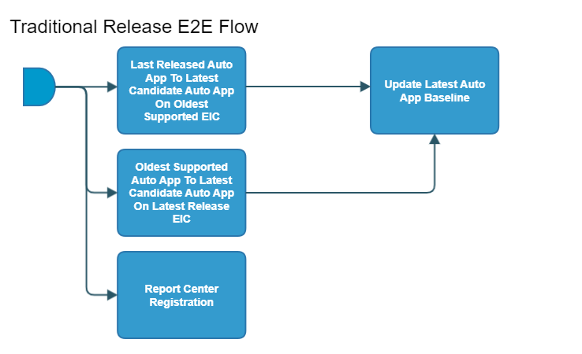

[TOC]

# autoapp-traditional-release-e2e-flow

[As an example, see EACC autoapp-traditional-release-e2e-flow here.](https://spinnaker.rnd.gic.ericsson.se/#/projects/auto_app_e2e_cicd/applications/autoapp-eacc-e2e-cicd/executions?pipeline=autoapp-eacc-traditional-release-E2E-Flow)

## Introduction:
This pipeline is the common auto app release pipeline for all auto apps which are placed under the auto_app_e2e_cicd Spinnaker project.

The main function of this pipeline is to simply orchestrate the calling of other pipelines in the autoapp traditional release E2E flow (which will be explained below).

This auto app pipeline uses the APP-MGR API endpoints of App Onboarding and App Lcm to Onboard and Instantiate the auto app onto EIAP. Please use the provided links for further information about the [App Onboarding](https://adp.ericsson.se/marketplace/app-onboarding) and [App Lcm](https://adp.ericsson.se/marketplace/app-lcm) APIs.

### Pipeline Parameters:
| Parameter | Description |
|-----|-----|
| CHART_NAME | Name of the auto app helm chart |
| CHART_REPO | Repo of the auto app helm chart |
| CHART_VERSION | Version of the auto app helm chart |
| CSAR_STORAGE_INSTANCE | Storage Instance (Staging and Release) to receive CSARs from |
| CSAR_STORAGE_REPO_RELEASE | Storage directory (Release) to receive the CSARs from |
| RCR_TAG | RCR Tag is used to identify the environment by Report Center Registration Stage for AutoApp release |
 * * *

## Pipeline Stages:

### Report Center Registration:
This stage runs a Jenkins Job [Staging-Report-Register](https://fem4s11-eiffel216.eiffel.gic.ericsson.se:8443/jenkins/job/Staging-Report-Register) (Regulus owned Jenkins job).

#### Description:
This Job sends the pipeline exection ID for logging and monitoring purposes.
 * * *

### Last Released Auto App To Latest Candidate Auto App On Oldest Supported EIAP:
This stage runs a Spinnaker pipeline last-released-auto-app-to-latest-candidate-auto-app-on-oldest-supported-eiap (Thunderbee owned pipeline).

[As an example, see the EACC last-released-auto-app-to-latest-candidate-auto-app-on-oldest-supported-eiap-flow here.](https://spinnaker.rnd.gic.ericsson.se/#/projects/auto_app_e2e_cicd/applications/autoapp-eacc-e2e-cicd/executions?pipeline=last-released-eacc-to-latest-candidate-eacc-on-oldest-supported-eiap-Flow)

#### Description:
This pipeline will execute the test loop for the use case of installing and upgrading the latest candidate auto app version on the oldest supported version of EIAP which has been released. For more information on this specific pipeline, please see the documentation for the pipeline [here](../../last_released_autoapp_on_oldest_eiap_flow/documentation/last_released_autoapp_on_oldest_eiap_flow.md)
 * * *

### Oldest Supported Auto App To Latest Candidate Auto App On Latest Release EIAP:
This stage runs a Spinnaker pipeline oldest-supported-auto-app-to-latest-candidate-auto-app-on-latest-release-eiap (Thunderbee owned pipeline).

[As an example, see the EACC oldest-supported-auto-app-to-latest-candidate-auto-app-on-latest-release-eiap-flow here.](https://spinnaker.rnd.gic.ericsson.se/#/projects/auto_app_e2e_cicd/applications/autoapp-eacc-e2e-cicd/executions?pipeline=oldest-supported-eacc-to-latest-candidate-eacc-on-latest-release-eiap-Flow)

#### Description:
This pipeline will execute the test loop for the use case of installing and upgrading the latest candidate auto app version on the latest version of EIAP which has been released. For more information on this specific pipeline, please see the documentation for the pipeline [here](../../oldest_supported_autoapp_on_latest_eiap_flow/documentation/oldest_supported_autoapp_on_latest_eiap_flow.md)
 * * *

### Update Latest Auto App Baseline:
This stage runs a Spinnaker pipeline autoapp-[auto app name]-check-baseline-version-and-update-Flow (Thunderbee owned pipeline).

[As an example, see the EACC autoapp-eacc-e2e-check-baseline-version-and-update-Flow here.](https://spinnaker.rnd.gic.ericsson.se/#/projects/auto_app_e2e_cicd/applications/autoapp-eacc-e2e-cicd/executions?pipeline=autoapp-eacc-check-baseline-version-and-update-Flow)

#### Description:
This pipeline will compare the current chart version wit the "LATEST_VERSION" in the baseline repo. If chart version is greater it will update the "LATEST_VERSION", please see the documentation for the pipeline [here](../../oldest_supported_autoapp_on_latest_eiap_flow/documentation/oldest_supported_autoapp_on_latest_eiap_flow.md)
 * * *
