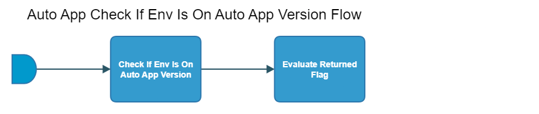

[TOC]

# autoapp-check-if-env-is-on-autoapp-version-flow

[As an example, see EACC autoapp-check-if-env-is-on-autoapp-version-flow here.](https://spinnaker.rnd.gic.ericsson.se/#/projects/auto_app_e2e_cicd/applications/autoapp-eacc-e2e-cicd/executions?pipeline=autoapp-eacc-check-if-env-is-on-autoapp-version-Flow)

## Introduction:
This pipeline is used as a failsafe by other piplines to ensure a test environment currently has the correct version of an auto app installed. If the test environment does not have the correct version of an auto app installed, this pipeline will fail.

This pipeline will be used for all auto apps which are placed under the auto_app_e2e_cicd Spinnaker project.

This auto app pipeline uses the APP-MGR API endpoint of App Lcm to check the version of the auto app on the test environment. Please use the provided link for further information about [App Lcm](https://adp.ericsson.se/marketplace/app-lcm) APIs.

### Pipeline Parameters:
| Parameter | Description |
|-----|-----|
| APPMGR_HOSTNAME | The App Manager hostname of the test environment. |
| AUTO_APP_CHART_NAME | The chart name of the Auto App. |
| AUTO_APP_CHART_VERSION | The chart version of the Auto App to be checked. |
| ENV_NAME | The name of the test environment. |
| ADMIN_USER_CREDENTIALS | ADMIN_USER_CREDENTIALS to run pipeline with. |
 * * *

## Pipeline Stages:

### Check If Env Is On Auto App Version:
This stage runs a Jenkins Job [APP-MGR-PC-Check-Is-Env-Auto-App-Version](https://fem5s11-eiffel216.eiffel.gic.ericsson.se:8443/jenkins/job/APP-MGR-PC-Check-Is-Env-Auto-App-Version/) (Thunderbee owned Jenkins job).

#### Description:
This Job is used to check if the environment is instantiated to a specific auto app version.
 * * *

### Evaluate Returned Flag:
This stage evaluates variables from the "Check If Env Is On Auto App Version" stage

#### Description:
This stage asserts variables returned from the "Check If Env Is On Auto App Version" stage and ensures they are what is expected of the pipeline. If the variables are not what is expected, this stage will fail the pipeline
 * * *
