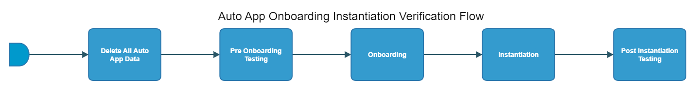

[TOC]

# autoapp-onboarding-instantiation-verification-flow

[As an example, see EACC autoapp-onboarding-instantiation-verification-flow here.](https://spinnaker.rnd.gic.ericsson.se/#/projects/auto_app_e2e_cicd/applications/autoapp-eacc-e2e-cicd/executions?pipeline=autoapp-eacc-onboard-instantiation-verification-Flow)

## Introduction:
This pipeline is used to onboard and instantiate different autoapps onto the necessary test environment. It can also be used to delete all auto app data from the necessary test environment if required to do so. Before the pipeline will onboard an autoapp, it will run pre onboarding testing of the specific auto app and after the auto app is instantiated, it will run post instantiation testing of the specific auto app. For any queries on pre onboarding or post instantiation testing, please contact the relevant auto app team as Thunderbee have no control over these stages.

This pipeline will be used for all auto apps which are placed under the auto_app_e2e_cicd Spinnaker project.

This auto app pipeline uses the APP-MGR API endpoints of App Onboarding and App Lcm to Onboard and Instantiate the auto app onto EIAP. Please use the provided links for further information about the [App Onboarding](https://adp.ericsson.se/marketplace/app-onboarding) and [App Lcm](https://adp.ericsson.se/marketplace/app-lcm) APIs.

### Pipeline Parameters:
| Parameter | Description |
|-----|-----|
| APPMGR_HOSTNAME | Hostname for APPMGR |
| CHART_NAME | Name of the auto app helm chart |
| CHART_VERSION | Version of the auto app helm chart |
| CHART_REPO | Repo of the auto app helm chart |
| ENVIRONMENT_NAME | Name of the Environment in which the auto app will be onboarded and instantiated |
| CSAR_PATH | The path of the Auto App CSAR |
| SKIP_CLEAN_UP | If set to true - all Auto App data will not be deleted |
| INSTANTIATION_TYPE | The type of instatiation to perform |
| KUBECONFIG_FILE_CREDENTIAL_ID | The jenkins credential id for Kubeconfig for the environment |
| NAMESPACE | The namespace in which the auto app will be onboarded and instantiated |
| AWS_CONFIG_FILE_CREDENTIAL_ID | Jenkins Credential id for aws config file (for AAS). |
| AWS_CREDS_FILE_CREDENTIAL_ID | Jenkins Credential id for aws creds file (for AAS). |
| ADMIN_USER_CREDENTIALS | ADMIN_USER_CREDENTIALS to run pipeline with. |
| INGRESS_CPS_USER | CPS Username for Pre/Post testing pipelines |
| INGRESS_HOST | Ingress Hostname for Pre/Post testing pipelines |
| INGRESS_LOGIN_PASSWORD | Ingress Password for Pre/Post testing pipelines |
| INGRESS_LOGIN_USER | Ingress Username for Pre/Post testing pipelines |
| RESTSIM_HOST | Restsim Host for Pre/Post testing pipelines |
 * * *

## Pipeline Stages:

### Delete All Auto App Data:
This stage runs a Jenkins job [APP-MGR-PC-Delete-All-Onboarded-Auto-Apps](https://fem5s11-eiffel216.eiffel.gic.ericsson.se:8443/jenkins/job/APP-MGR-PC-Delete-All-Onboarded-Auto-Apps/) (Thunderbee owned Jenkins job).

#### Description:
The job implements a function to delete all the onboarded Auto Apps for a given Auto App name.
 * * *

### Pre Onboarding Testing:
This stage is controlled by the owner of the auto app and in this stage, the owning team will specify the specific pre onboarding testing pipeline to run
 * * *

### Onboarding:
This stage runs a Jenkins job [APP-MGR-PC-Onboard-Auto-App](https://fem5s11-eiffel216.eiffel.gic.ericsson.se:8443/jenkins/job/APP-MGR-PC-Onboard-Auto-App/) (Thunderbee owned Jenkins job).

#### Description:
This job implements a function to Onboard an Auto App.
 * * *

### Instantiation:
This stage runs a Jenkins Job [APP-MGR-PC-Instantiate-Auto-App](https://fem5s11-eiffel216.eiffel.gic.ericsson.se:8443/jenkins/job/APP-MGR-PC-Instantiate-Auto-App/) (Thunderbee owned Jenkins job).

#### Description:
This job implements a function to Instantiate an Auto App.
 * * *

### Post Instantiation Testing:
This stage is controlled by the owner of the auto app and in this stage, the owning team will specify the specific post instantiation testing pipeline to run
 * * *
