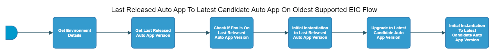

[TOC]

# last-released-autoapp-on-oldest-eiap-flow

[As an example, see EACC last-released-autoapp-on-oldest-eiap-flow here.](https://spinnaker.rnd.gic.ericsson.se/#/projects/auto_app_e2e_cicd/applications/autoapp-eacc-e2e-cicd/executions?pipeline=last-released-eacc-to-latest-candidate-eacc-on-oldest-supported-eiap-Flow)

## Introduction:
This pipeline is used to verify that the latest candidate auto app can both be installed and upgraded to on the oldest version of EIAP that we support. It will perform the upgrade and install from the latest released version of the auto app.

This pipeline will be used for all auto apps which are placed under the auto_app_e2e_cicd Spinnaker project.

This auto app pipeline uses the APP-MGR API endpoints of App Onboarding and App Lcm to Onboard and Instantiate the auto app onto EIAP. Please use the provided links for further information about the [App Onboarding](https://adp.ericsson.se/marketplace/app-onboarding) and [App Lcm](https://adp.ericsson.se/marketplace/app-lcm) APIs.

### Pipeline Parameters:
| Parameter | Descirption |
|-----|-----|
| CHART_NAME | Name of the auto app helm chart |
| CHART_VERSION | Version of the auto app helm chart |
| CHART_REPO | Repo of the auto app helm chart |
| ENVIRONMENT_NAME | Name of the Environment in which the auto app will be onboarded and instantiated |
| CSAR_STORAGE_INSTANCE | Storage Instance (Staging and Release) to receive CSARs from |
| CSAR_STORAGE_REPO_RELEASE | Storage directory (Release) to receive the CSARs from |
 * * *

## Pipeline Stages:

### Get Environment Details:
This stage runs a Jenkins job [RPT-RC_Retrieve-Environment-Details](https://fem5s11-eiffel216.eiffel.gic.ericsson.se:8443/jenkins/job/RPT-RC_Retrieve-Environment-Details/) (Thunderbee owned Jenkins job).

#### Description:
This Job is to retrieve the properties of a Test Environment in RPT.
 * * *

### Get Last Released Auto App Version:
This stage runs a Jenkins job [BASE-VERS_Retrieve_Baseline_Version](https://fem5s11-eiffel216.eiffel.gic.ericsson.se:8443/jenkins/job/BASE-VERS_Retrieve_Baseline_Version) (Thunderbee owned Jenkins job).

#### Description:
The job retrieves the last released auto app baseline version from the auto app baseline versions file.

[The latest auto app version can be found in the baseline-version autoapp_versions file on gerrit.](https://gerrit.ericsson.se/plugins/gitiles/OSS/com.ericsson.oss.cicd/baseline-versions/+/refs/heads/master/autoapp_versions.json)
 * * *

### Check If Env Is On Last Released Auto App Version:
This stage runs a Spinnaker pipeline check-if-env-is-on-last-released-auto-app-version (Thunderbee owned pipeline).

[As an example, see the EACC check-if-env-is-on-last-released-auto-app-version-flow here.](https://spinnaker.rnd.gic.ericsson.se/#/projects/auto_app_e2e_cicd/applications/autoapp-eacc-e2e-cicd/executions?pipeline=autoapp-eacc-check-if-env-is-on-autoapp-version-Flow)

#### Description:
This "child" pipeline will ensure your test environment has an instantiated instance of the auto app to the last released auto app version. If the test environment does not have this version instantiated, the child pipeline will fail, which will cause the overall latest-released-autoapp-to-latest-candidate-autoapp-on-oldest-supported-eiap-Flow to fail. For more information on the autoapp-check-if-env-is-on-autoapp-version pipeline, see the documentation for that pipeline [here](../../common_release_child_flows/documentation/autoapp_check_if_env_is_on_autoapp_version_flow.md)
 * * *

### Initial Instantiation To Last Released Auto App Version:
This stage runs a Spinnaker pipeline initial-instantiation-to-last-release-auto-app-version (Thunderbee owned pipeline).

[As an example, see the EACC initial-instantiation-to-last-release-auto-app-version-flow here.](https://spinnaker.rnd.gic.ericsson.se/#/projects/auto_app_e2e_cicd/applications/autoapp-eacc-e2e-cicd/executions?pipeline=autoapp-eacc-onboard-instantiation-verification-Flow)

#### Description:
This "child" pipeline will perform an "initial_instantiation" of the auto app running through this pipeline to the last released version (i.e the N version present in the versions file mentioned above). An auto app must already be instantiated on the test environment for this pipeline to run successfully, however, this pipeline will cleanup the instantiated app data for this auto app. For more information on the initial-instantiation-to-last-release-auto-app-version pipeline, see the documenation for that pipeline [here](../../common_release_child_flows/documentation/autoapp_onboarding_instantiation_verification_flow.md)
 * * *

### Upgrade To Latest Candidate Auto App Version:
This stage runs a Spinnaker pipeline upgrade-to-latest-candidate-autoapp-version (Thunderbee owned pipeline).

[As an example, see the EACC upgrade-to-latest-candidate-autoapp-version-flow here.](https://spinnaker.rnd.gic.ericsson.se/#/projects/auto_app_e2e_cicd/applications/autoapp-eacc-e2e-cicd/executions?pipeline=autoapp-eacc-onboard-instantiation-verification-Flow)

#### Description:
This "child" pipeline will perform an "instantiation_to_higher_version" of the auto app running through this pipeline to the latest candidate version (i.e the N+1 version). An auto app must already be instantiated on the test environment for this pipeline to run successfully. For more information on the this pipeline, see the documenation for the pipeline [here](../../common_release_child_flows/documentation/autoapp_onboarding_instantiation_verification_flow.md)
 * * *

### Initial Instantiation To Latest Candidate Auto App Version:
This stage runs a Spinnaker pipeline initial-instantiation-to-latest-candidate-autoapp-version (Thunderbee owned pipeline).

[As an example, see the EACC initial-instantiation-to-latest-candidate-autoapp-version-flow here.](https://spinnaker.rnd.gic.ericsson.se/#/projects/auto_app_e2e_cicd/applications/autoapp-eacc-e2e-cicd/executions?pipeline=autoapp-eacc-onboard-instantiation-verification-Flow)

#### Description:
This "child" pipeline will perform an "initial_instantiation" of the auto app running through this pipeline to the latest candidate version (i.e the N+1 version). An auto app must already be instantiated on the test environment for this pipeline to run successfully, however, this pipeline will cleanup the instantiated app data for this auto app. For more information on the this pipeline, see the documenation for the pipeline [here](../../common_release_child_flows/documentation/autoapp_onboarding_instantiation_verification_flow.md)
 * * *
