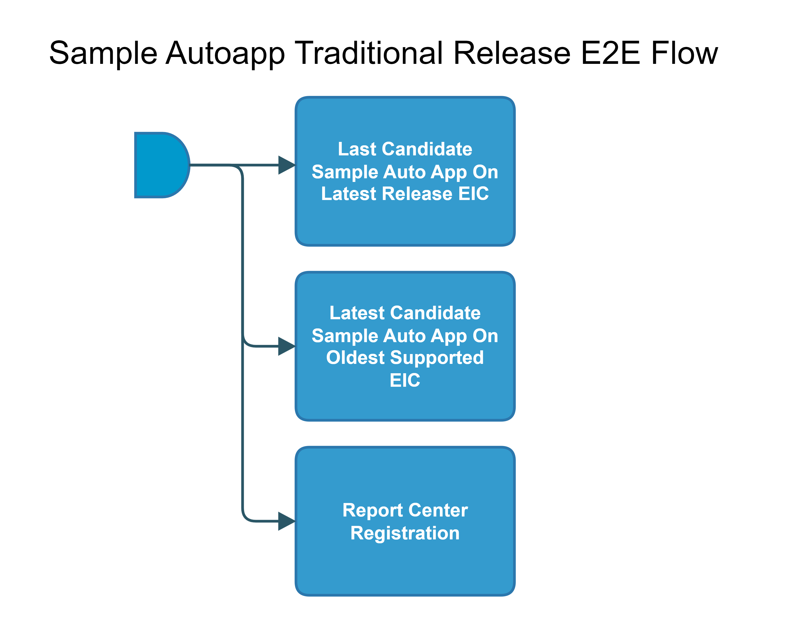

[TOC]

# sample-autoapp-traditional-release-E2E-Flow

Example of Sample Auto App release E2E pipeline:

[hello-world-go-app-traditional-release-E2E-Flow](https://spinnaker.rnd.gic.ericsson.se/#/applications/autoapp-hello-world-go-app-e2e-cicd/executions?pipeline=hello-world-go-app-traditional-release-E2E-Flow)

## Introduction:
This pipeline is the common Sample Auto App release E2E pipeline.

The product staging and release pipelines for Sample Auto Apps, such as the [Hello World Go App](https://developer.intelligentautomationplatform.ericsson.net/#tutorials/go-sample-app) and [Hello World Python App](https://developer.intelligentautomationplatform.ericsson.net/#tutorials/sample-app-in-python), differ from those for conventional Auto Apps, like EACC and PME.

While the release flow for conventional Auto Apps runs the following:

* Intial Instantiation To Last Released Auto App Version
* Upgrade To Latest Candidate Auto App Version
* Initial Instantiation To Latest Candidate Auto App Version

For Sample Auto Apps only the following will be done:

* Intial Instantiation To Last Released Sample Auto App Version

The main function of this pipeline is to simply orchestrate the calling of other pipelines in the Sample Auto App release E2E flow (which will be explained below).

The Sample Auto App pipeline uses the APP-MGR API endpoints of App Onboarding and App Lcm to Onboard and Instantiate the auto app onto EIC. Please use the provided links for further information about the [App Onboarding](https://developer.intelligentautomationplatform.ericsson.net/#capabilities/app-onboarding) and [App Lcm](https://developer.intelligentautomationplatform.ericsson.net/#capabilities/app-lifecycle-management) APIs.

### Pipeline Parameters:
| Parameter | Description |
|-----|-----|
| CHART_NAME | Name of the auto app helm chart |
| CHART_REPO | Repo of the auto app helm chart |
| CHART_VERSION | Version of the auto app helm chart |
| CSAR_STORAGE_INSTANCE | Storage Instance (Staging and Release) to receive CSARs from |
| LATEST_RELEASE_EIC_BRANCH | Branch for latest release EIC version |
| OLDEST_SUPPORTED_EIC_BRANCH | Branch for oldest supported EIC version |
| RCR_TAG | RCR Tag is used to identify the environment by Report Center Registration Stage for AutoApp release |
 * * *

## Pipeline Stages:

### Latest Candidate Sample Auto App On Latest Release EIC:
This stage runs a Spinnaker pipeline sample-autoapp-onboard-instantiation-verification-Flow (Thunderbee owned pipeline).

See, for example:
[hello-world-go-app-onboard-instantiation-verification-Flow](https://spinnaker.rnd.gic.ericsson.se/#/applications/autoapp-hello-world-go-app-e2e-cicd/executions?pipeline=hello-world-go-app-onboard-instantiation-verification-Flow)

#### Description:
This pipeline will execute the test loop for the use case of installing and upgrading the latest candidate Sample Auto App version on the latest version of EIC which has been released. For more information on this specific pipeline, please see the documentation for the pipeline [here](../../common_release_child_flows/documentation/sample-autoapp-onboard-instantiation-verification-Flow.md)
 * * *

### Latest Candidate Sample Auto App On Oldest Supported EIC:
This stage runs a Spinnaker pipeline sample-autoapp-onboard-instantiation-verification-Flow (Thunderbee owned pipeline).

See, for example:
[hello-world-go-app-onboard-instantiation-verification-Flow](https://spinnaker.rnd.gic.ericsson.se/#/applications/autoapp-hello-world-go-app-e2e-cicd/executions?pipeline=hello-world-go-app-onboard-instantiation-verification-Flow)

#### Description:
This pipeline will execute the test loop for the use case of installing and upgrading the latest candidate Sample Auto App version on the oldest supported version of EIC which has been released. For more information on this specific pipeline, please see the documentation for the pipeline [here](../../common_release_child_flows/documentation/sample-autoapp-onboard-instantiation-verification-Flow.md)
 * * *

### Report Center Registration:
This stage runs a Jenkins Job [Staging-Report-Register](https://fem4s11-eiffel216.eiffel.gic.ericsson.se:8443/jenkins/job/Staging-Report-Register) (Regulus owned Jenkins job).

#### Description:
This Job sends the pipeline exection ID for logging and monitoring purposes.
 * * *
