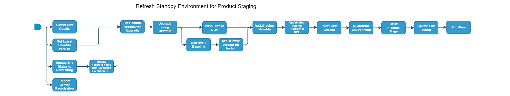

[TOC]

# refresh-standby-env-for-product-staging

[refresh-standby-env-for-product-staging](https://spinnaker.rnd.gic.ericsson.se/#/applications/product-e2e-cicd/executions/configure/3c1982f7-475e-47f0-a5eb-44186296651e)
## Introduction:
The use of a single "sticky" environment in IDUN Product Staging can lead to issues with the "backing-up" of builds that test new changes coming into the pipeline, resulting in delays and failures. The Refresh pipeline has been developed as one of the measures aimed at reducing queueing and execution times for the Product Staging pipeline. It achieves this through the automation of two processes:

1. The Refresh pipeline, when triggered against multiple standby environments according to a schedule in the [Resource Pooling Tool (RPT)](https://rpt.ews.gic.ericsson.se/#/), ensures that a suitably prepared environment, upgraded/installed to the latest "green" baseline, will be available for “on-demand” use in the Product Staging flow. This minimizes the possibility that an Install will be required on the current environment, reducing execution times and permitting increased frequency of executions. The work to refresh standby environments was implemented under the following Jira (including linked Jiras): [IDUN-8060 RPT Work for Refreshing Standby Test Environments](https://jira-oss.seli.wh.rnd.internal.ericsson.com/browse/IDUN-8060)
2. In the event of a failure in the Product Staging pipeline, and following the swapping-in of a refreshed standby environment for the existing “sticky” environment, the Refresh pipeline is used to automatically redeploy the swapped-out environment (the environment on which a failure has occurred). This facilitates removal of the redeploy process from the Product Staging pipeline itself, allowing the flow to recommence using a pre-prepared environment, without the need to wait for the original environment to be redeployed. This also helps prevent blockages in the pipeline, in cases where the redeploy is not successful. The work to swap in a refreshed environment and redeploy the swapped out environment was implemented under the following Jira (including linked Jiras): [IDUN-12632 Update Refresh E2E Flow](https://jira-oss.seli.wh.rnd.internal.ericsson.com/browse/IDUN-12632)

### Useful Links
The design of the Refresh flow and automation, described below, are based upon the findings of investigative work conducted under the following OA:

* [IDUN-3295 Test Environment Preparation OA](https://jira-oss.seli.wh.rnd.internal.ericsson.com/browse/IDUN-3295)
Further details may be found here:
* [Test Environment Preparation OA Documentation](https://confluence-oss.seli.wh.rnd.internal.ericsson.com/x/9KBUGw)
The development and implementation work were undertaken as part of the following step (including linked Jiras):
* [IDUN-15928 Test Environment Preparation for PSO Step](https://jira-oss.seli.wh.rnd.internal.ericsson.com/browse/IDUN-15928)
Further development of the Refresh pipeline, including using the green II baseline for Install (rather than the latest EIAP helmfile version), revised logic to determine which test environments should be refreshed and increased frequency of the refresh process (modified cron), was undertaken as part of the following ticket (including linked Jiras):
* [IDUN-23682 Rollout of Job to get Green II Baseline](https://jira-oss.seli.wh.rnd.internal.ericsson.com/browse/IDUN-23682)

### **Logic Used to Determine which Environments to Refresh**

Logic in RPT determines which test environments should be refreshed when the process is triggered according to a Cron. Environments in a designated pool are filtered by status, with only those in "Standby" being considered for refresh. Of these "Standby" environments, a designated number (those on the most recent versions of EIAP) will be retained in the pool, so that there will always be a certain number of environments available for use. The remaining "Standby" environments are then checked against a specified number of the most recent, released EIAP versions and the Refresh pipeline will be triggered for any on versions older than these.

>#### Info:
> Currently, "PSO\_Sandby" is the pool designated to be checked for eligible environments requiring refreshing. The two "Standby" environments in the pool on the most recent versions are retained (i.e. not considered for refresh). Of the remaining "Standby" environments, currently any on versions older than the 5 most recent released EIAP versions will be refreshed. However, variables, such as the designated "Standby" pool name, the number of "Standby" environments to be retained, the number of most recent EIAP versions to be used for comparison and the Cron schedule, are all subject to revision.

### **Changes in Test Environment Status**

For the test environments selected for refresh, their status is updated to "Refreshing" while they pass through the pipeline and, if either the Upgrade or Install is successful, on completion of the flow, the test environment's status is set back to "Standby". In the event that both Upgrade and Install are unsuccessful, the status of the Test Environment is set to "Quarantine".

In the case that the Refresh pipeline is being used to redeploy a swapped-out environment (i.e. the flow is automatically triggered by a failure in the Product Staging pipeline), the Test Environment will be in the "Reserved" status it was in while passing through the Product Staging pipeline; its status is updated to "Refreshing" at the start of the Refresh pipeline and, if the Install is successful (Upgrade is skipped in this case), on completion of the flow, the test environment's status is set to "Standby".

### **Paths Through the Pipeline**

There are three possible flows through the Refresh pipeline:

* Upgrade using Helmfile:

In the course of the flow, an Upgrade of the Test Environment to the latest (or specified) version is first attempted

* Install using Helmfile:

If the `SKIP_UPGRADE` parameter has the value `false` (see table below), and the attempted Upgrade of the Test Environment fails, an Install to the green II baseline (or specified) version is then attempted

If the `SKIP_UPGRADE` parameter has the value `true`, an Install to the green II baseline (or specified) version is performed

* Quarantine Test Environment

 If the attempted Install of the Test Environment fails (the attempted Upgrade having previously failed, or been skipped), the Test Environment status is set to "Quarantine"

 * * *
## Pipeline Parameters:
| Parameter | Description |
|-----|-----|
| ENV_NAME | Name of standby test environment to be refreshed |
| RCF_TAG | RCF Tag is used to identify the environment by Report Center Registration Stage for Child flows |
| FUNCTIONAL_USER_SECRET | Functional user for logging into armdocker |
| ARMDOCKER_USER_SECRET | Jenkins credentials ID for Docker login configuration file |
| INT_CHART_NAME | Name of the integration chart which will be used for the Initial install |
| INT_CHART_REPO | Repo of the Integration Chart which will be used for the Initial Install |
| INT_CHART_VERSION | Version of the Integration Chart which will be used for the Initial Install |
| SLAVE_LABEL | Label to choose which Jenkins slave to execute Jenkinsfiles against |
| HELM_TIMEOUT | Timeout for helmfile deploy |
| PATH_TO_SITE_VALUES_FILE | The Path where all the necessary site values are located for the install/upgrade |
| TAGS | Applications that should be switched on during deployment |
| USE_LATEST_HELMFILE_VERSION | Determines whether latest Helmfile version is used in Upgrade/Install. If set to `false`, version used will be that specified as value for INT_CHART_VERSION |
| SKIP_UPGRADE |  |
| PATH_TO_SITE_VALUES_OVERRIDE_FILE | PATH_TO_SITE_VALUES_OVERRIDE_FILE |
| USE_DM_PREPARE | When set to true uses the site values generated from the Deployment manager prepare command for the deployment. |
| SKIP_CRD_DEPLOY | Skip CRD Deploy |
| ENVIRONMENT_STATUS | Status to set for the environment |
 * * *

## Pipeline stages:

### Report Center Registration:
This stage runs a Jenkins job [Staging-Report-Register](https://fem4s11-eiffel216.eiffel.gic.ericsson.se:8443/jenkins/job/Staging-Report-Register) (Regulus owned Jenkins job).

#### Description:
 This stage sends the pipeline execution ID for logging and monitoring

 * * *
### Update Pipeline Stage with Spinnaker execution URL:
This stage runs a Jenkins job [RPT-RC_Update-PipelineStage](https://fem5s11-eiffel216.eiffel.gic.ericsson.se:8443/jenkins/job/RPT-RC_Update-PipelineStage) (Thunderbee owned Jenkins job).

#### Description:
This Job implements a function to update the Pipeline Stage of test environment in RPT.
 * * *
### Update Env Status to Refreshing:
This stage runs a Jenkins job [RPT-RC_Update-Test-Environment-Status](https://fem5s11-eiffel216.eiffel.gic.ericsson.se:8443/jenkins/job/RPT-RC_Update-Test-Environment-Status) (Thunderbee owned Jenkins job).

#### Description:
This Job is to update the status of a Test Environment in RPT.
 * * *
### Gather Env Details:
This stage runs a Jenkins job [Gather-Env-Details](https://fem7s11-eiffel216.eiffel.gic.ericsson.se:8443/jenkins/job/Gather-Env-Details) (TicketMaster owned Jenkins job).

#### Description:
This Job gets the environment details from Gerrit.
 * * *
### Get Latest Helmfile Version:
This stage runs a Jenkins job [Get-Latest-ChartOrHelmfile](https://fem7s11-eiffel216.eiffel.gic.ericsson.se:8443/jenkins/job/Get-Latest-ChartOrHelmfile) (TicketMaster owned Jenkins job).

#### Description:
This Job gets the latest version of the Integration of the Helmfile.
 * * *
### Set Helmfile Version for Upgrade:
This stage evaluates variables and sets the `INT_CHART_VERSION`.

#### Description:
This stage takes the `INT_CHART_VERSION` returned from 'Get Latest Helmfile Version' unless an `INT_CHART_VERSION` is provided in Execution parameters.
 * * *
### Upgrade using Helmfile:
This stage runs a spinnaker pipeline [deploy-using-helmfile](https://spinnaker.rnd.gic.ericsson.se/#/applications/base-platform-e2e-cicd/executions/configure/08535c6d-871c-4b85-81bb-6f4f5c568969) (TicketMaster owned pipeline).

#### Description:
This Pipeline Cleans down a deployment and deploys a new Helmfile.
 * * *
### Retrieve II Baseline:
This stage runs a Jenkins job [BASE-VERS_Retrieve_Baseline_Version](https://fem5s11-eiffel216.eiffel.gic.ericsson.se:8443/jenkins/job/BASE-VERS_Retrieve_Baseline_Version) (Thunderbee owned Jenkins job).

#### Description:
The job retrieves the baseline version from a given versions file.
 * * *
### Set Helmfile Version for Install:
This stage evaluates variables and sets the `INT_CHART_VERSION`.

#### Description:
This stage takes the `INT_CHART_VERSION`returned from 'Get Latest Helmfile Version' unless an `INT_CHART_VERSION` is provided in Execution parameters.
 * * *

### Push Data to DDP:
This stage runs a Jenkins job [CICD-UTILS-DDP-Upload](https://fem7s11-eiffel216.eiffel.gic.ericsson.se:8443/jenkins/job/CICD-UTILS-DDP-Upload/) (Thunderbee owned Jenkins job).

#### Description:
This job will execute the necessary logic to push environment data to DDP before running an Install
 * * *

### Install using Helmfile:
This stage runs a spinnaker pipeline [deploy-using-helmfile](https://spinnaker.rnd.gic.ericsson.se/#/applications/base-platform-e2e-cicd/executions/configure/08535c6d-871c-4b85-81bb-6f4f5c568969) (TicketMaster owned pipeline).

#### Description:
This Pipeline Cleans down a deployment and deploys a new Helmfile.
 * * *
### Update Env Version Property in RPT:
This stage runs a Jenkins job [RPT-RC_Update-Environment-Details](https://fem5s11-eiffel216.eiffel.gic.ericsson.se:8443/jenkins/job/RPT-RC_Update-Environment-Details) (Thunderbee owned Jenkins job).

#### Description:
This Job is to update the properties of a test environment in RPT.
 * * *
### Post Flow Checks

Checks preconditions for successful execution of the pipeline.
 * * *
### Quarantine Environment:
This stage runs a Jenkins job [RPT-RC_Quarantine-Environment](https://fem5s11-eiffel216.eiffel.gic.ericsson.se:8443/jenkins/job/RPT-RC_Quarantine-Environment) (Thunderbee owned Jenkins job).

#### Description:
 This Job implements a function to quarantine a test environment in RPT.
 * * *
### Clear Pipeline Stage:
This stage runs a Jenkins job [RPT-RC_Update-PipelineStage](https://fem5s11-eiffel216.eiffel.gic.ericsson.se:8443/jenkins/job/RPT-RC_Update-PipelineStage) (Thunderbee owned Jenkins job).

#### Description:
This Job implements a function to update the Pipeline Stage of test environment in RPT
 * * *
### Update Env Status:
This stage runs a Jenkins job [RPT-RC_Update-Test-Environment-Status](https://fem5s11-eiffel216.eiffel.gic.ericsson.se:8443/jenkins/job/RPT-RC_Update-Test-Environment-Status) (Thunderbee owned Jenkins job).

#### Description:
This Job updates the status of a test environment in RPT.
 * * *
### End Flow
Checks preconditions for successful execution of the pipeline.
