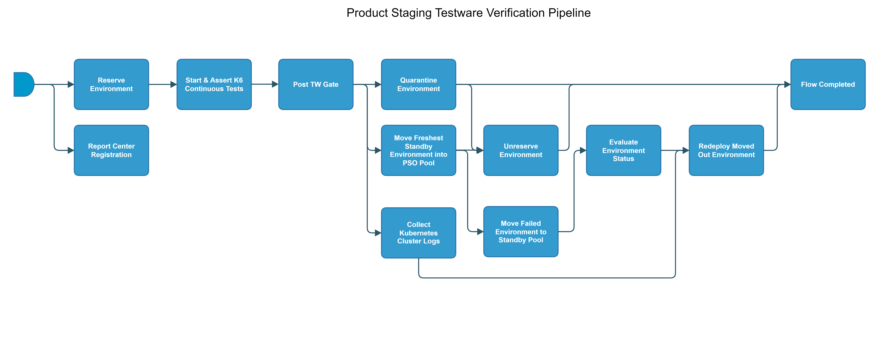

[TOC]

# product-staging-testware-verification

[product-staging-testware-verification](https://spinnaker.rnd.gic.ericsson.se/#/applications/product-e2e-cicd/executions/configure/bab6e0fa-47a5-4a3c-bc5a-24ee2c496b30)
This Pipeline performs the necessary steps to run K6 tests and assertions.
## Pipeline Parameters:
| Parameter | Description |
|-----|-----|
| TW_GERRIT_REFSPEC | New TW version to be tested via a gerrit ref spec |
| TAGS | Applications that should be switch on during deployment |
| QUARANTINE_ENV | Set this parameter to true if you wish for the environment to be quarantined if the deployment flow false |
| RCR_TAG | RCR Tag is used to identify the environment by Report Center Registration Stage |
| ENV_DETAILS_DIR | This is the directory within the Repo specified within the Gather-Env-Details Jenkins job where to find the pooling environment details |
| ENV_LABEL | This is the label to search for that is attached to the environments in the Lockable Resource Plugin on Jenkins |
| FLOW_URL_TAG | Flow URL Tag is used when locking the environment to add a tag to describe what has locked the environment for easier tracking |
| WAIT_TIME | This is the time to wait for an Environment to become available. After the time expires the job will fail out |
| SLAVE_LABEL | Label to choose which Jenkins slave to execute Jenkinsfiles against |
| FUNCTIONAL_USER_SECRET | Functional user for logging into armdocker |
| STANDBY_POOL_NAME | Name of the pool containing 'Standby' test environments. |
| PSO_FLOW_POOL_NAME | Name of the pool containing current environment being used in the Product Staging pipeline. |
 * * *

## Pipeline Stages:

### Reserve Environment:
This stage runs a Jenkins job [RPT-RC_Reserve-Environment](https://fem5s11-eiffel216.eiffel.gic.ericsson.se:8443/jenkins/job/RPT-RC_Reserve-Environment) (Thunderbee owned Jenkins job).

#### Description:
This Job implements a function to reserve a Test Environment in RPT.
 * * *

### Report Center Registration:
This stage runs a Jenkins job [Staging-Report-Register](https://fem4s11-eiffel216.eiffel.gic.ericsson.se:8443/jenkins/job/Staging-Report-Register) (Regulus owned Jenkins job).

#### Description:
This stage sends the pipeline execution ID for logging and monitoring
 * * *

### Start & Assert K6 Continuous Tests:
This stage runs a spinnaker pipeline [k6-Start-&-Assert](https://spinnaker.rnd.gic.ericsson.se/#/applications/product-e2e-cicd/executions/configure/303b7ebb-146b-4956-8ec2-86aef3d37817) (Banba owned pipeline).

#### Description:
This stage starts K6 tests.
 * * *

### Post TW Gate

Checks preconditions for successful execution of the pipeline.
 * * *

### Quarantine Environment:
This stage runs a Jenkins job [RPT-RC_Quarantine-Environment](https://fem5s11-eiffel216.eiffel.gic.ericsson.se:8443/jenkins/job/RPT-RC_Quarantine-Environment) (Thunderbee owned Jenkins job).

#### Description:
This Job implements a function to quarantine a test environment in RPT.
 * * *

### Move Freshest Standby Environment into PSO Pool:
This stage runs a Jenkins job [RPT-RC_Update_Freshest_Standby_Environment_To_Available_And_Swap_Pool](https://fem5s11-eiffel216.eiffel.gic.ericsson.se:8443/jenkins/job/RPT-RC_Update_Freshest_Standby_Environment_To_Available_And_Swap_Pool) (Thunderbee owned Jenkins job).

#### Description:
This Job is to update the freshest standby environment in a pool to available and swap it into a new pool.
 * * *

### Collect Kubernetes Cluster Logs
This stage runs a Jenkins job
[Get-K8S-Logs](https://fem5s11-eiffel052.eiffel.gic.ericsson.se:8443/jenkins/job/Get-K8S-logs) (Application Staging owned Jenkins job).
[Pipeline Documentation](https://gerrit.ericsson.se/plugins/gitiles/OSS/com.ericsson.oss.aeonic/oss-integration-ci/+/master/docs/files/Get_Kubernetes_Logs.md)
 * * *

### Unreserve Environment:
This stage runs a Jenkins job [RPT-RC_Unreserve-Environment](https://fem5s11-eiffel216.eiffel.gic.ericsson.se:8443/jenkins/job/RPT-RC_Unreserve-Environment) (Thunderbee owned Jenkins job).

#### Description:
This Job implements a function to unreserve a test environment in RPT.
 * * *

### Move Failed Environment to Standby Pool:
This stage runs a Jenkins job [RPT-RC_Swap_Test_Environment_Pool](https://fem5s11-eiffel216.eiffel.gic.ericsson.se:8443/jenkins/job/RPT-RC_Swap_Test_Environment_Pool) (Thunderbee owned Jenkins job).

#### Description:
This Job is to swap a test environment out of the specified pool and into another specified pool.
 * * *

### Evaluate Environment Status
This stage evaluates variables to be referenced downstream.

#### Description:
This stage evaluates:

- ENVIRONMENT_STATUS

 * * *

### Redeploy Moved Out Environment:
This stage runs a spinnaker pipeline [refresh-standby-env-for-product-staging](https://spinnaker.rnd.gic.ericsson.se/#/applications/product-e2e-cicd/executions/configure/3c1982f7-475e-47f0-a5eb-44186296651e) (Thunderbee owned pipeline). [Pipeline Documentation](/../../cicd_pipelines_documentation_and_diagrams/product_staging/eiap_product_staging_child_flows/documentation/refresh_standby_env_for_product_staging.md)

#### Description:
This pipeline performs a Refresh of a standby environment.
 * * *

### Flow Completed
Checks preconditions for successful execution of the pipeline.
 * * *
