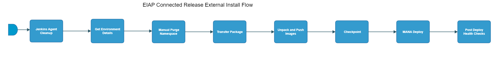

[TOC]

# eiap-connected-release-external-install-flow

[eiap-connected-release-external-install-flow](https://spinnaker.rnd.gic.ericsson.se/#/applications/eiap-release-e2e-cicd/executions/configure/ba0b55b6-7e2a-407a-9061-80ea3b9fce18)
## Introduction:
This Pipeline is a standalone pipeline to perform an install of EIAP on an External environment.
 * * *

## Pipeline Stages:

### Jenkins Agent Cleanup:
This stage runs a Jenkins job [oss-idun-release-cicd_Jenkins_Agent_Cleanup](https://fem5s11-eiffel052.eiffel.gic.ericsson.se:8443/jenkins/job/oss-idun-release-cicd_Jenkins_Agent_Cleanup) (Thunderbee owned Jenkins job).

#### Description:
This job cleans the agent it is run on.

 * * *
### Get Environment Details:
This stage runs a Jenkins job [DSC-DIT-Download-Document-As-Artifact](https://fem5s11-eiffel216.eiffel.gic.ericsson.se:8443/jenkins/job/DSC-DIT-Download-Document-As-Artifact) (Thunderbee owned Jenkins job).

#### Description:
This Job is to retrieve the properties of a Test Environment in DIT.

 * * *
### Manual Purge Namespace:
This stage requires a decision by the pipeline operator.

> **_Instructions:_** "Is the manual purge of namespace complete?
Are all pre-requisites done?"
 * * *
### Transfer Package:
This stage runs a Jenkins job [oss-idun-release-cicd_Files_Transfer_Between_Agents](https://fem5s11-eiffel052.eiffel.gic.ericsson.se:8443/jenkins/job/oss-idun-release-cicd_Files_Transfer_Between_Agents) (Thunderbee owned Jenkins job).

#### Description:
This job is used to transfer the files from one VM to another.

 * * *
### Unpack and Push Images:
This stage runs a Jenkins job [oss-idun-release-cicd_Unpack_And_Push_Images](https://fem5s11-eiffel052.eiffel.gic.ericsson.se:8443/jenkins/job/oss-idun-release-cicd_Unpack_And_Push_Images) (Thunderbee owned Jenkins job).

#### Description:
This job is used to push the images to the Container Registry.

 * * *
### Checkpoint:
This stage requires a decision by the pipeline operator.

> **_Instructions:_** "Check the transferred package. Does it have correct files?"
 * * *
### MANA Deploy:
This stage runs a Jenkins job [oss-idun-release-cicd_MANA_Deploy](https://fem5s11-eiffel052.eiffel.gic.ericsson.se:8443/jenkins/job/oss-idun-release-cicd_MANA_Deploy) (Thunderbee owned Jenkins job).

#### Description:
This job is used to install/upgrade the EIAP on an environment.

 * * *
### Post Deploy Health Check:
This stage runs a Jenkins job [oss-idun-release-cicd_MANA_Health_Check](https://fem5s11-eiffel052.eiffel.gic.ericsson.se:8443/jenkins/job/oss-idun-release-cicd_MANA_Health_Check) (Thunderbee owned Jenkins job).

#### Description:
This job checks the status of the Deployment using HELM on MANA environments.

