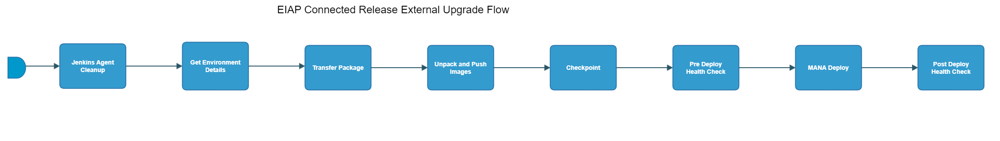

[TOC]

# eiap-connected-release-external-upgrade-flow

[eiap-connected-release-external-upgrade-flow](https://spinnaker.rnd.gic.ericsson.se/#/applications/eiap-release-e2e-cicd/executions/configure/0b592fb3-2d61-436c-b2df-f615787138c3)
## Introduction:
This Spinnaker pipeline is used to perform the upgrade of an external customer environment.
 * * *

## Pipeline Stages:

### Jenkins Agent Cleanup:
This stage runs a Jenkins job [oss-idun-release-cicd_Jenkins_Agent_Cleanup](https://fem5s11-eiffel052.eiffel.gic.ericsson.se:8443/jenkins/job/oss-idun-release-cicd_Jenkins_Agent_Cleanup) (Thunderbee owned Jenkins job).

#### Description:
This Jenkins job cleans the agent it runs on.

 * * *
### Get Environment Details:
This stage runs a Jenkins job [DSC-DIT-Download-Document-As-Artifact](https://fem5s11-eiffel216.eiffel.gic.ericsson.se:8443/jenkins/job/DSC-DIT-Download-Document-As-Artifact) (Thunderbee! owned Jenkins job).

#### Description:
 This Job is to retrieve the properties of a Test Environment in DIT.

 * * *
### Transfer Package:
This stage runs a Jenkins job [oss-idun-release-cicd_Files_Transfer_Between_Agents](https://fem5s11-eiffel052.eiffel.gic.ericsson.se:8443/jenkins/job/oss-idun-release-cicd_Files_Transfer_Between_Agents) (Thunderbee owned Jenkins job).

#### Description:
This job is used to transfer the files from one VM to another.

 * * *
### Unpack and Push Images:
This stage runs a Jenkins job [oss-idun-release-cicd_Unpack_And_Push_Images](https://fem5s11-eiffel052.eiffel.gic.ericsson.se:8443/jenkins/job/oss-idun-release-cicd_Unpack_And_Push_Images) (Thunderbee owned Jenkins job).

#### Description:
This job is used to push the images to the Container Registry.

 * * *
### Checkpoint:
This stage requires a decision by the pipeline operator.

> **_Instructions:_** "Check the transferred package. Does it have correct files?"
 * * *
### Pre Deploy Health Check:
This stage runs a Jenkins job [oss-idun-release-cicd_MANA_Health_Check](https://fem5s11-eiffel052.eiffel.gic.ericsson.se:8443/jenkins/job/oss-idun-release-cicd_MANA_Health_Check) (Thunderbee owned Jenkins job).

#### Description:
This job checks the status of the Deployment using HELM on MANA environments.

 * * *
### MANA Deploy:
This stage runs a Jenkins job [oss-idun-release-cicd_MANA_Deploy](https://fem5s11-eiffel052.eiffel.gic.ericsson.se:8443/jenkins/job/oss-idun-release-cicd_MANA_Deploy) (Thunderbee owned Jenkins job).

#### Description:
This job is used to install/upgrade the EIAP on an environment.

 * * *
### Post Deploy Health Check:
This stage runs a Jenkins job [oss-idun-release-cicd_MANA_Health_Check](https://fem5s11-eiffel052.eiffel.gic.ericsson.se:8443/jenkins/job/oss-idun-release-cicd_MANA_Health_Check) (Thunderbee owned Jenkins job).

#### Description:
This job checks the status of the Deployment using HELM on MANA environments.
