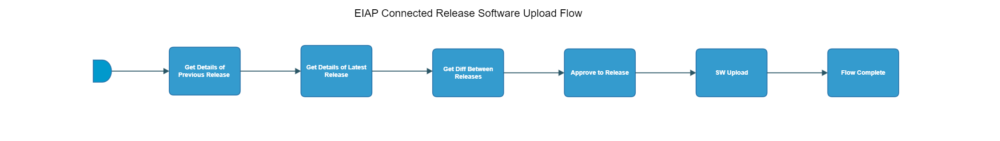

[TOC]

# eiap-connected-release-software-upload-flow

[eiap-connected-release-software-upload-flow](https://spinnaker.rnd.gic.ericsson.se/#/applications/eiap-release-e2e-cicd/executions/configure/e419c371-dd86-42dd-9231-2e01b6d187fd)

> **_Note:_** This is a temporary solution. The deliverable [IDUN-14238-  Determine a solution to present and query the baseline](https://jira-oss.seli.wh.rnd.internal.ericsson.com/browse/IDUN-14238) will be used to get/update the baseline information in CaaP E2E flow.

## Introduction:
This Pipeline uses a script to perform a difference between two helmfile versions and generates an artifact.properties file which is then consumed by the DP-RAF to perform the SW upload to the SWGW.
 * * *

## Pipeline Stages:

### Get Details of Previous Release:
This stage runs a Jenkins job [GetAppVersionFromHelmfile](https://fem5s11-eiffel052.eiffel.gic.ericsson.se:8443/jenkins/job/GetAppVersionFromHelmfile) (Ticketmaster/Honeypot owned Jenkins job).

#### Description:
This stage extracts the App version from the Helmfile.

 * * *
### Get Details of Latest Release:
This stage runs a Jenkins job [GetAppVersionFromHelmfile](https://fem5s11-eiffel052.eiffel.gic.ericsson.se:8443/jenkins/job/GetAppVersionFromHelmfile) (Ticketmaster/Honeypot owned Jenkins job).

#### Description:
This stage extracts the App version from the Helmfile.

 * * *
### Get Diff Between Releases:
This stage runs a Jenkins job [oss-idun-release-cicd_Get_Difference_Between_App_Versions](https://fem5s11-eiffel052.eiffel.gic.ericsson.se:8443/jenkins/job/oss-idun-release-cicd_Get_Difference_Between_App_Versions) (Thunderbee owned Jenkins job).

#### Description:
This job produces difference between two releases.

 * * *
### Approve to Release:
This stage requires a decision by the pipeline operator.

> **_Instructions:_** "Are we ready to release the SW to SWGW?"
 * * *
### SW Upload:
This stage runs a Jenkins job [DP-RAF](https://fem2s11-eiffel216.eiffel.gic.ericsson.se:8443/jenkins/job/DP-RAF/) (CM team owned Jenkins job).

#### Description:
This Jenkins job uses DP-RAF to perform the upload of SW to SWGW.

 * * *
### Flow Completed

Checks preconditions for successful execution of the pipeline.

