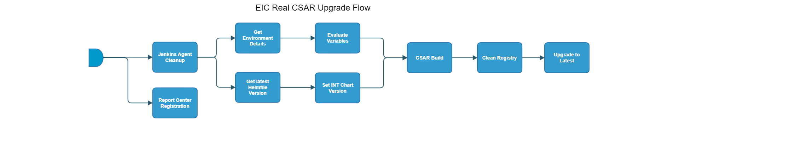

[TOC]

# eic-real-csar-upgrade-flow

[eic-real-csar-upgrade-flow](https://spinnaker.rnd.gic.ericsson.se/#/applications/eiap-release-e2e-cicd/executions/configure/e8ffc0aa-7b88-4aa3-a6d9-65d85b14cad9)
## Introduction:
This pipeline is a Standalone pipeline which performs an install/upgrade of EIAP software on a Test Environment
 * * *

## Pipeline Parameters:
| Parameter | Description |
|-----|-----|
| JENKINS_AGENT | Specify the Jenkins agent that you want the job to run on. |
| INT_CHART_VERSION | Leave this blank if you want to use the latest INT Chart Version. |
| USE_REAL_CSAR | When set to true the script will try to download the officially Released CSARs relation to the version of the applications within the helmfile being deployed. |
| TAGS | List of tags for applications that have to be deployed |
| TEST_ENVIRONMENT | Name of the Test Environment to use for the flow. |
| NAMESPACE | Namespace where EIC will be deployed |
| DEPLOYMENT_MANAGER_REPO | Deployment Manager Repository. |
| DEPLOYMENT_MANAGER_VERSION | Deployment Manager version. |
| FULL_PATH_TO_SITE_VALUES_FILE | Path within the Repo to the location of the site values file. |
| USE_DM_PREPARE | When set to true uses the site values generated from the Deployment manager prepare command for the deployment. |
| RSR_TAG | RSR Tag is used to identify the environment by Report Center Registration Stage for Release stage |
| DDP_AUTO_UPLOAD | When set to true, enables the DDP auto upload. |
| K6_TESTWARE_VERSION | The version of the K6 testware to be used. |
| CLEAN_DOCKER_REGISTRY | When set to true, the clean docker registry job will run. |
| RUN_ENM_INTEGRATION_TEST | When set to true, ENM integration tests will be run. |
* * *
## Pipeline Stages

### Report Center Registration:
This stage runs a Jenkins job [Staging-Report-Register](https://fem4s11-eiffel216.eiffel.gic.ericsson.se:8443/jenkins/job/Staging-Report-Register) (Regulus owned Jenkins job).

#### Description:
 This stage sends the pipeline execution ID for logging and monitoring

 * * *

### Jenkins Agent Cleanup:
This stage runs a Jenkins job [oss-idun-release-cicd_Jenkins_Agent_Cleanup](https://fem5s11-eiffel052.eiffel.gic.ericsson.se:8443/jenkins/job/oss-idun-release-cicd_Jenkins_Agent_Cleanup) (Thunderbee owned Jenkins job).

#### Description:
This job cleans the agent it is run on.

 * * *
### Get Environment Details:
This stage runs a Jenkins job [DSC-DIT-Download-Document-As-Artifact](https://fem5s11-eiffel216.eiffel.gic.ericsson.se:8443/jenkins/job/DSC-DIT-Download-Document-As-Artifact) (Thunderbee owned Jenkins job).

#### Description:
This Job is to retrieve the properties of a Test Environment in DIT.

 * * *
### Evaluate Variables:
This stage evaluates variables from Get Environment Details stage.

#### Description:
This stage asserts variables returned from the Get Environment Details stage are correct.
If the parameters are not returned then a default is provided.

 * * *
### Get Latest Helmfile Version:
This stage runs a Jenkins job [Get-Latest-ChartOrHelmfile](https://fem5s11-eiffel052.eiffel.gic.ericsson.se:8443/jenkins/job/Get-Latest-ChartOrHelmfile) (Ticketmaster/Honeypot owned Jenkins job).

#### Description:
This job gets the latest chart or Helmfile version.
This is passed back into the pipeline as INT_CHART_VERSION

 * * *
### Set INT Chart Version:
This stage evaluates variables and sets the INT_CHART_VERSION.

#### Description:
This stage takes the INT_CHART_VERSION returned from 'Get Latest Helmfile Version' unless an INT_CHART_VERSION is provided in Execution parameters.
 * * *
### CSAR Build:
This stage runs a Spinnaker pipeline [eiap-release-csar-build-flow](https://spinnaker.rnd.gic.ericsson.se/#/applications/eiap-release-e2e-cicd/executions/configure/c187f4db-555a-4a9a-a331-6dfdc79a5b97) (Ticketmaster owned pipeline).

#### Description:
This stage is a Spinnaker pipeline and is used to build all of the CSARs to be included in EIAP.
The CSAR Build stage runs only if the USE_REAL_CSAR parameter is set to true. The default value for the pipeline is set to true.

 * * *
### Clean Registry:
This stage runs a Jenkins job [oss-idun-release-cicd_MANA_Clean_Images_In_Docker_Registry](https://fem5s11-eiffel052.eiffel.gic.ericsson.se:8443/jenkins/job/oss-idun-release-cicd_MANA_Clean_Images_In_Docker_Registry) (Thunderbee owned Jenkins job).

#### Description:
This stage runs a Jenkins Job which cleans up docker images which are not in use from the environments docker registry.

 * * *
### Upgrade to Latest:
This stage runs a Spinnaker pipeline [eiap-release-upgrade-flow](https://spinnaker.rnd.gic.ericsson.se/#/applications/eiap-release-e2e-cicd/executions/configure/59c0789e-51e9-4e5d-9387-53e276cda158) (Thunderbee owned pipeline).

#### Description:
This stage performs the upgrade of the internal Test Environment and does the verification (K6 tests).
