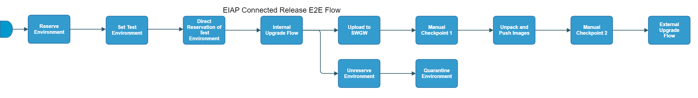

[TOC]

# eiap-connected-release-e2e-Flow

[eiap-connected-release-e2e-Flow](https://spinnaker.rnd.gic.ericsson.se/#/applications/eiap-release-e2e-cicd/executions/configure/b7c0e15e-7ba6-4307-b792-511211477ff9)
## Introduction:
The Connected as a Product pipeline (CaaP) in EIAP release performs internal upgrade/tests, external release, and LCM of the SW released to the customers. This pipeline sits to the right of EIAP Product Staging and is divided into two parts:

1. The upgrade and testing of the SW in an internal Test Environment.
2. The delivery and upgrade of the SW in the external environment (customer site).

As of now, the idea is to run this pipeline once daily and upgrade the EIAP software to the latest green baseline (or to a specific version of the helmfile).

**Connected as a Product (CaaP)** is a software distribution model in which a software provider continuously deploys their software into a customer provided infrastructure on a high frequency basis (at least daily).

 * * *

## Pipeline Stages:

### Reserve Environment:
This stage runs a Jenkins job [RPT-RC_Reserve-Environment](https://fem5s11-eiffel216.eiffel.gic.ericsson.se:8443/jenkins/job/RPT-RC_Reserve-Environment) (Thunderbee owned Jenkins job).

#### Description:
This Job implements a function to reserve a Test Environment in RPT.

 * * *
### Set Test Environment:
This stage runs evaluates variables and sets RESOURCE_NAME

#### Description:
This stage checks if a parameter INTERNAL_TEST_ENVIRONMENT is set in execution parameters.
If the value is not null this Environment is used otherwise the Environment name returned from 'Reserve Environment' is used.

 * * *
### Direct Reservation of Test Environment:
This stage runs a Jenkins job [RPT-RC_Update-Test-Environment-Status](https://fem5s11-eiffel216.eiffel.gic.ericsson.se:8443/jenkins/job/RPT-RC_Update-Test-Environment-Status) (Thunderbee owned Jenkins job).

#### Description:
This Job is to update the status of a Test Environment in RPT.

 * * *
### Internal Upgrade Flow:
This stage runs a Spinnaker pipeline [eic-real-csar-upgrade-flow](https://spinnaker.rnd.gic.ericsson.se/#/applications/eiap-release-e2e-cicd/executions/configure/e8ffc0aa-7b88-4aa3-a6d9-65d85b14cad9) (Thunderbee owned pipeline).

#### Description:
This pipeline performs an install/upgrade of EIAP software on a Test Environment.
[Pipeline Documentation](../../caap_internal_child_flows/documentation/eic_real_csar_upgrade_flow.md).

 * * *
### Upload to SWGW:
This stage runs a Spinnaker pipeline [eiap-connected-release-software-upload-flow](https://spinnaker.rnd.gic.ericsson.se/#/applications/eiap-release-e2e-cicd/executions/configure/e419c371-dd86-42dd-9231-2e01b6d187fd) (Thunderbee owned pipeline).

#### Description:
This Pipeline uses a script to perform a difference between two helmfile versions and generates an artifact.properties file which is then consumed by the DP-RAF to perform the SW upload to the SWGW
[Pipeline Documentation](../../caap_internal_child_flows/documentation/eiap_connected_release_software_upload_flow.md).
 * * *
### Manual Checkpoint 1:
This stage requires a decision by the pipeline operator.

> **_Instructions:_** "Are all the CSARs available for the upgrade operation."
 * * *
### Unpack and Push Images:
This stage runs a Jenkins job [oss-idun-release-cicd_Unpack_And_Push_Images](https://fem5s11-eiffel052.eiffel.gic.ericsson.se:8443/jenkins/job/oss-idun-release-cicd_Unpack_And_Push_Images) (Thunderbee owned Jenkins job).

#### Description:
This job is used to push the images to the Container Registry.

 * * *
### Manual Checkpoint 2:
This stage requires a decision by the pipeline operator.

> **_Instructions:_** "Are all the images present in the Docker registry"
 * * *
### External Upgrade Flow:
This stage runs a Spinnaker pipeline [eiap-connected-release-external-upgrade-flow](https://spinnaker.rnd.gic.ericsson.se/#/applications/eiap-release-e2e-cicd/executions/configure/0b592fb3-2d61-436c-b2df-f615787138c3) (Thunderbee owned pipeline).

#### Description:
This Spinnaker pipeline is used to perform the install or upgrade of an external customer environment.
[Pipeline Documentation](../../caap_external_child_flows/documentation/eiap-connected-release-external-upgrade-flow.md).

 * * *
### Unreserve Environment:
This stage runs a Jenkins job [RPT-RC_Unreserve-Environment](https://fem5s11-eiffel216.eiffel.gic.ericsson.se:8443/jenkins/job/RPT-RC_Unreserve-Environment) (Thunderbee owned Jenkins job).

#### Description:
This Job implements a function to unreserve a Test Environment in RPT.

 * * *
### Quarantine Environment:
This stage runs a Jenkins job [RPT-RC_Quarantine-Environment](https://fem5s11-eiffel216.eiffel.gic.ericsson.se:8443/jenkins/job/RPT-RC_Quarantine-Environment) (Thunderbee owned Jenkins job).

#### Description:
This Job implements a function to quarantine a Test Environment in RPT.
