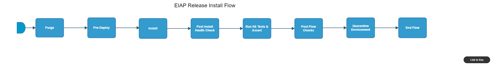

[TOC]

# eiap-release-install-flow

[eiap-release-install-flow](https://spinnaker.rnd.gic.ericsson.se/#/applications/eiap-release-e2e-cicd/executions/configure/9586d39d-db4d-40d8-a691-1178c766f65c)
## Introduction:
This Pipeline performs the steps necessary for an Install of EIAP on an Environment

## Pipeline Parameters:
| Parameter | Description |
|-----|-----|
| DEPLOYMENT_NAME | Name of the deployment |
| RCF_TAG | RCF Tag is used to identify the environment by Report Center Registration Stage for Child flows |
| NAMESPACE | Namespace of environment |
| KUBECONFIG_FILE | Kubernetes configuration file to specify which environment to install on |
| PATH_TO_CERTIFICATES_FILES | Path within the Repo to the location of the certificates directory |
| INT_CHART_VERSION | The version of integration chart |
| USE_REAL_CSAR | Option to use real CSAR. If false then dummy CSAR will be used |
| GAS_HOSTNAME | Hostname for GAS |
| IAM_HOSTNAME | Hostname for IAM |
| ADC_HOSTNAME | Hostname for ADC |
| APPMGR_HOSTNAME | Hostname for APPMGR |
| BDR_HOSTNAME | Hostname for BDR |
| TAGS |  |
| OS_HOSTNAME | Hostname for OS |
| TA_HOSTNAME | Hostname for TA |
| TH_HOSTNAME | Hostname for TH |
| ENM_HOSTNAME | Hostname for ENM |
| ECM_HOSTNAME | Hostname for ECM |
| LA_HOSTNAME | Hostname for Log Aggregator (LA) |
| ML_HOSTNAME | Hostname for Machine Learning Application (ML) |
| KF_BO_HOSTNAME | Hostname for Kafka Bootstrap |
| EIC_HOSTNAME | Hostname for EIC |
| SKIP_TESTS | Skips given test scenarios e.g. CANARY_UPGRADE_01, CANARY_UPGRADE_03 |
| RUN_TESTS | Run given tests scenarios and nothing else e.g. CANARY_UPGRADE_01, CANARY_UPGRADE_03 |
| CONFIG_FILES | By default these tests will run e.g., ['main_multiple_iterations.json', 'main_single_iteration.json', 'main_CU2.json'] Override it if needed |
| DOCKER_REGISTRY |  |
| DOCKER_REGISTRY_CREDENTIALS |  |
| SLAVE_LABEL |  |
| SERVICE_MESH_IP | Service Mesh Load Balancer IP Address |
| DEPLOYMENT_MANAGER_REPO | Deployment Manager Repository. |
| DEPLOYMENT_MANAGER_VERSION | Deployment Manager version. |
| PATH_TO_SITE_VALUES_OVERRIDE_FILE | Path within the Repo to the location of the site values override file.  The content of this file will be added or will override the content in the FULL_PATH_TO_SITE_VALUES_FILE |
| FULL_PATH_TO_SITE_VALUES_FILE | Path within the Repo to the location of the site values file. |
| USE_DM_PREPARE | When set to true uses the site values generated from the Deployment manager prepare command for the deployment. |
| K6_TESTWARE_VERSION | The version of the K6 testware to be used |
| FH_SNMP_ALARM_IP | IP address for Fault Handling SNMP Alarm IP |
| DDP_AUTO_UPLOAD | When set to true, enables the DDP auto upload |
| ENV_CONFIG_FILE | Can be used to specify the environment configuration file which has specific details only for the environment under test |
| CLEANUP_TYPE | The Type of cleanup that needs to be done. FULL will cleanup the deployment helm releases, crd helm releases, crd components, clusterroles, cluster rolebindings, namespaces (deployment and crd). Where as PARTIAL will only cleanup the deployment namespace. FULL cleanup option should NOT be used in such cases where single cluster is hosting multiple deployments. |
| RUN_ENM_INTEGRATION_TEST | When set to true, ENM integration tests will be run |
| USE_CERTM | Set to true to use the "--use-certm" tag during the deployment |
| SKIP_K6_TEST | When set to true, Run k6 Tests & Assert stage will be skipped |
 * * *

## Pipeline Stages:

### Purge:
This stage runs a Jenkins job [Purge-Release-in-Namespace](https://fem5s11-eiffel052.eiffel.gic.ericsson.se:8443/jenkins/view/TicketMaster/job/Purge-Release-in-Namespace) (Ticketmaster owned Jenkins job).

#### Description:
This job used to remove any old helm charts and PVC's from a given namespace.

 * * *
### Pre-Deploy:
This stage runs a Spinnaker pipeline [IDUN-Pre-Deployment](https://spinnaker.rnd.gic.ericsson.se/#/applications/common-e2e-cicd/executions/configure/88012023-7839-4eca-92f4-f87715ed77ad) (Ticketmaster owned pipeline).

#### Description:
This pipeline performs pre-requisites before starting the deployment of EIAP.

 * * *
### Install:
This stage runs a Jenkins job [helmfile-deploy](https://fem5s11-eiffel052.eiffel.gic.ericsson.se:8443/jenkins/job/helmfile-deploy) (Ticketmaster owned Jenkins job).

#### Description:
Performs the Install
Checks the status of the Deployment using HELM

 * * *
### Post Install Health Check:
This stage runs a Jenkins job [OSS-Integration-HealthCheck-Using-DM](https://fem5s11-eiffel052.eiffel.gic.ericsson.se:8443/jenkins/job/OSS-Integration-HealthCheck-Using-DM) (Ticketmaster owned Jenkins job).

#### Description:
Checks the status of the Deployment using HELM

 * * *
### Run k6 Tests & Assert:
This stage runs a Spinnaker pipeline [IDUN_Prod_Eng_K6_single_iteration_release](https://spinnaker.rnd.gic.ericsson.se/#/applications/banba/executions/configure/e908f29c-e1ac-4df5-a8e3-0cae7a426efe) (Banba owned pipeline).

#### Description:
Runs K6 Tests against [eric-oss-product-engineering|https://gerrit-gamma.gic.ericsson.se/plugins/gitiles/OSS/com.ericsson.oss.productEngineering/eric-oss-product-engineering]

 * * *
### Post Flow Checks

Checks preconditions for successful execution of the pipeline.
 * * *
### Quarantine Environment:
This stage runs a Jenkins job [RPT-RC_Quarantine-Environment](https://fem5s11-eiffel216.eiffel.gic.ericsson.se:8443/jenkins/job/RPT-RC_Quarantine-Environment) (Thunderbee owned Jenkins job).

#### Description:
This Job implements a function to quarantine a Test Environment in RPT.

 * * *
### Push Data to DDP:
This stage runs a Jenkins job [CICD-UTILS-DDP-Upload](https://fem5s11-eiffel052.eiffel.gic.ericsson.se:8443/jenkins/job/CICD-UTILS-DDP-Upload/) (Thunderbee owned Jenkins job).

#### Description:
This job will execute the necessary logic to push environment data to DDP before running an Install

 * * *
### End Flow

Checks preconditions for successful execution of the pipeline.
