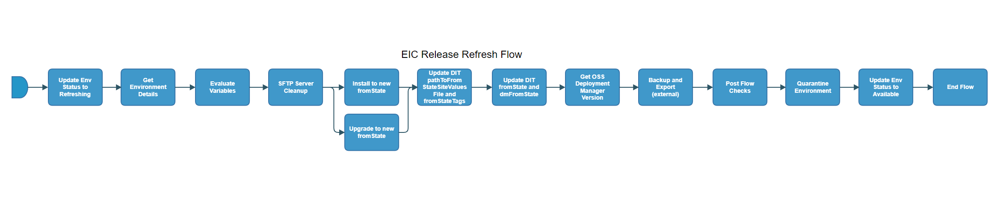

[TOC]

# eiap-release-refresh-flow

[eiap-release-refresh-flow](https://spinnaker.rnd.gic.ericsson.se/#/applications/eiap-release-e2e-cicd/executions/configure/1c8da476-d85e-4e34-9e8e-2c4edbb33d48)
## Introduction:
For new sprints/releases, the from states of EIAP Test Environments will need to be updated to the correct version of software. Therefore a refresh pipeline is required for this function.

## Pipeline Parameters:
| Parameter | Description |
|-----|-----|
| NEW_FROM_STATE | The fromState to be updated and used S2L and R2L loops |
| DEPLOYMENT_NAME | Name of the deployment |
| USE_REAL_CSAR | Option to use real CSAR. If false then dummy CSAR will be used |
| NEW_FROM_STATE_TAGS | List of tags for applications that have to be deployed |
| DOCKER_REGISTRY |  |
| DOCKER_REGISTRY_CREDENTIALS |  |
| NAMESPACE |  |
| SFTP_CREDENTIALS_ID | Credentials for SFTP |
| SFTP_SERVER_PATH | Server path of SFTP |
| DEPLOYMENT_MANAGER_REPO | Deployment Manager Repository. |
| NEW_DM_FROM_STATE | Update the Deployment Manager From State. |
| NEW_FROM_STATE_K6_VERSION | Update the K6 From State. |
| DEPLOYMENT_TYPE | Install or upgrade deployment. |
| USE_DM_PREPARE | When set to true uses the site values generated from the Deployment manager prepare command for the deployment. |
| PATH_TO_FROM_STATE_SITE_VALUES_FILE | Path within the Repo to the location of the site values file associated to the from state value. The content of this file will be added or will override the content in the FULL_PATH_TO_SITE_VALUES_FILE |
| PATH_TO_FROM_STATE_SITE_VALUES_OVERRIDE_FILE | Path within the Repo to the location of the site values override file associated to the from state value. The content of this file will be added or will override the content in the FULL_PATH_TO_SITE_VALUES_FILE |
| DDP_AUTO_UPLOAD | When set to true, enables the DDP auto upload |
| CLEANUP_TYPE | The Type of cleanup that needs to be done. FULL will cleanup the deployment helm releases, crd helm releases, crd components, clusterroles, cluster rolebindings, namespaces (deployment and crd). Where as PARTIAL will only cleanup the deployment namespace. FULL cleanup option should NOT be used in such cases where single cluster is hosting multiple deployments. |
| RUN_ENM_INTEGRATION_TEST | When set to true, ENM integration tests will be run |
 * * *

## Pipeline Stages:

### Update Env Status to Refreshing:
This stage runs a Jenkins job [RPT-RC_Update-Test-Environment-Status](https://fem5s11-eiffel216.eiffel.gic.ericsson.se:8443/jenkins/job/RPT-RC_Update-Test-Environment-Status) (Thunderbee owned Jenkins job).

#### Description:
This Job is to update the status of a Test Environment in RPT.
 * * *
### Get Environment Details:
This stage runs a Jenkins job [DSC-DIT-Download-Document-As-Artifact](https://fem5s11-eiffel216.eiffel.gic.ericsson.se:8443/jenkins/job/DSC-DIT-Download-Document-As-Artifact) (Thunderbee owned Jenkins job).

#### Description:
This Job is to retrieve the properties of a Test Environment in DIT.
 * * *

### Evaluate Variables:
This stage evaluates variables to be referenced downstream

#### Description:
This stage evaluates:

- SKIP_TESTS
- RUN_TESTS
- ECM_HOSTNAME
- ENM_HOSTNAME

 * * *
### SFTP Server Cleanup:
This stage runs a spinnaker pipeline [EIC_Release_SFTP_Server_Cleanup](https://fem5s11-eiffel052.eiffel.gic.ericsson.se:8443/jenkins/job/EIC_Release_SFTP_Server_Cleanup/) (Release owned job).

#### Description
This stage performs a cleans up all backups from external EIC Release SFTP server.
 * * *
### Install to new fromState:
This stage runs a Spinnaker pipeline [eiap-release-install-flow](https://spinnaker.rnd.gic.ericsson.se/#/applications/eiap-release-e2e-cicd/executions/configure/9586d39d-db4d-40d8-a691-1178c766f65c) (Thunderbee owned pipeline). [Pipeline_Documentation](/../../cicd_pipelines_documentation_and_diagrams/release/common_release_child_flows/documentation/eiap_release_install_flow.md)

#### Description:
This Pipeline performs the steps necessary for an Install of an EIAP Environment
 * * *
### Upgrade to new fromState:
This stage runs a Spinnaker pipeline [eiap-release-upgrade-flow](https://spinnaker.rnd.gic.ericsson.se/#/applications/eiap-release-e2e-cicd/executions/configure/59c0789e-51e9-4e5d-9387-53e276cda158) (Thunderbee owned pipeline). [Pipeline_Documentation](/../../cicd_pipelines_documentation_and_diagrams/release/common_release_child_flows/documentation/eiap_release_upgrade_flow.md)

#### Description:
This Pipeline performs the steps necessary for an Upgrade of EIAP Environment
 * * *
### Update From State details in DIT:
This stage runs a Jenkins job [DSC-DIT-Update-Key-Value-Pairs](https://fem5s11-eiffel216.eiffel.gic.ericsson.se:8443/jenkins/job/DSC-DIT-Update-Key-Value-Pairs) (Thunderbee owned Jenkins job).

#### Description:
 This Job is to update the properties of a Test Environment in DIT.
### Update DIT fromState and dmFromState:
This stage runs a Jenkins job [DSC-DIT-Update-Key-Value-Pairs](https://fem5s11-eiffel216.eiffel.gic.ericsson.se:8443/jenkins/job/DSC-DIT-Update-Key-Value-Pairs) (Thunderbee owned Jenkins job).

#### Description:
This stage changes the EIAP version and DM version of the Test Environment in DIT, so that the version of the environment and the DM can be tracked, and viewed in a UI for visualization purposes.
 * * *
### Get OSS Deployment Manager Version:
This stage evaluates variables to be referenced downstream

#### Description:
This stage evaluates:

- DEPLOYMENT_MANAGER_VERSION

 * * *
### Backup and Export (external):
This stage runs a Spinnaker pipeline [eiap-release-backup-flow](https://spinnaker.rnd.gic.ericsson.se/#/applications/eiap-release-e2e-cicd/executions/configure/5b07fdbe-a832-4ff3-baa1-946a90c8b610) (Thunderbee owned pipeline). [Pipeline Documentation](/../../cicd_pipelines_documentation_and_diagrams/release/taap_release_child_flows/documentation/eiap_release_backup_flow.md)

#### Description:
This pipeline performs a Backup and Export

 * * *
### Post Flow Checks

Checks preconditions for successful execution of the pipeline.
 * * *
### Quarantine Environment:
This stage runs a Jenkins job [RPT-RC_Quarantine-Environment](https://fem5s11-eiffel216.eiffel.gic.ericsson.se:8443/jenkins/job/RPT-RC_Quarantine-Environment) (Thunderbee owned Jenkins job).

#### Description:
This Job implements a function to quarantine a Test Environment in RPT.
 * * *
### Update Env Status to Available:
This stage runs a Jenkins job [RPT-RC_Update-Test-Environment-Status](https://fem5s11-eiffel216.eiffel.gic.ericsson.se:8443/jenkins/job/RPT-RC_Update-Test-Environment-Status) (Thunderbee owned Jenkins job).

#### Description:
This Job is to update the status of a Test Environment in RPT.
 * * *
### End Flow

Checks preconditions for successful execution of the pipeline.
 * * *
