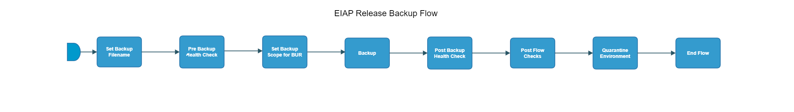

[TOC]

# eiap-release-backup-flow

[eiap-release-backup-flow](https://spinnaker.rnd.gic.ericsson.se/#/applications/eiap-release-e2e-cicd/executions/configure/5b07fdbe-a832-4ff3-baa1-946a90c8b610)
## Introduction:
This pipeline performs a Backup and Export

## Pipeline Parameters:
| Parameter | Description |
|-----|-----|
| DEPLOYMENT_MANAGER_VERSION | The version of Deployment Manager needed |
| NAMESPACE | Namespace of environment |
| KUBECONFIG_FILE | Kubernetes configuration file to specify which environment to install on |
| GAS_HOSTNAME | Hostname for GAS |
| VNFM_HOSTNAME | Hostname for VNFM |
| SFTP_CREDENTIALS_ID | Credentials for SFTP |
| SFTP_SERVER_PATH | Server path of SFTP |
| INT_CHART_VERSION | The version of EIAP chart version needed to be displayed in the EIAP release dashboard |
| DEPLOYMENT_NAME | Name of the deployment |

 * * *

## Pipeline Stages:

### Set Backup Filename:
his stage evaluates variables to be referenced downstream

#### Description:
This stage evaluates:

- BACKUP_DIRECTORY

 * * *

### Pre Backup Health Check:
This stage runs a Jenkins job [OSS-Integration-HealthCheck-Using-DM](https://fem5s11-eiffel052.eiffel.gic.ericsson.se:8443/jenkins/job/OSS-Integration-HealthCheck-Using-DM) (Ticketmaster owned Jenkins job).

#### Description:
Checks the status of the Deployment using HELM

 * * *
### Set Backup Scope for BUR:
This stage runs a Jenkins job [Compare_Deployment_Manager_Version_for_BUR](https://fem5s11-eiffel052.eiffel.gic.ericsson.se:8443/jenkins/job/Compare_Deployment_Manager_Version_for_BUR/) (Laika owned Jenkins job).

#### Description:
This Jenkins Job determines the value of the `BACKUP_SCOPE` property based on a comparison between two parameters, `DEPLOYMENT_MANAGER_VERSION` and `MIN_VERSION`. The result of the comparison is then written to artifact.properties to be used in the Backup Stage.

 * * *
### Backup:
This stage runs a Jenkins job [EO_BUR_Run_Backup](https://fem5s11-eiffel052.eiffel.gic.ericsson.se:8443/jenkins/job/EO_BUR_Run_Backup) (Laika owned Jenkins job).

#### Description:
Pipeline used for testing Backup & Restore script

 * * *
### Post Backup Health Check:
This stage runs a Jenkins job [OSS-Integration-HealthCheck-Using-DM](https://fem5s11-eiffel052.eiffel.gic.ericsson.se:8443/jenkins/job/OSS-Integration-HealthCheck-Using-DM) (Ticketmaster owned Jenkins job).

#### Description:
Check the status of the Deployment using HELM

 * * *
### Post Flow Checks

Checks preconditions for successful execution of the pipeline.
 * * *
### Quarantine Environment:
This stage runs a Jenkins job [RPT-RC_Quarantine-Environment](https://fem5s11-eiffel216.eiffel.gic.ericsson.se:8443/jenkins/job/RPT-RC_Quarantine-Environment) (Thunderbee owned Jenkins job).

#### Description:
This Job implements a function to quarantine a Test Environment in RPT.

 * * *
### End Flow

Checks preconditions for successful execution of the pipeline.

