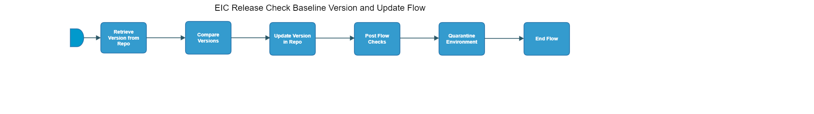

[TOC]

# eiap-release-check-baseline-version-and-update-flow

[eiap-release-check-baseline-version-and-update-flow](https://spinnaker.rnd.gic.ericsson.se/#/applications/eiap-release-e2e-cicd/executions/configure/80abc630-5d75-45a1-89a1-071471332494)
## Introduction:
Retrieves the current Upgrade baseline version from the 'baseline-versions' repository. Compares it against a version from a successful Upgrade/Install in the "eiap-traditional-release-e2e-Flow" pipeline.
If necessary, updates the stored Upgrade baseline version in the repository.

## Pipeline Parameters:
| Parameter | Description |
|-----|-----|
| VERSION_FOR_COMPARISON | Version to compare against version in repo |
| ENVIRONMENT_NAME | Name of the environment being used in the pipeline |
| BASELINE_VERSION_KEY | The key of the baseline version that will be retrieved from the repo and, if necessary, updated |

 * * *

## Pipeline Stages:

### Retrieve Version from Repo:
This stage runs a Jenkins job [BASE-VERS_Retrieve_Baseline_Version](https://fem5s11-eiffel216.eiffel.gic.ericsson.se:8443/jenkins/job/BASE-VERS_Retrieve_Baseline_Version) (Thunderbee owned Jenkins job).

#### Description:
The job retrieves the baseline version from a given versions file.

 * * *
### Compare Versions:
This stage runs a Jenkins job [BASE-VERS_Compare_Version_With_Baseline_Version](https://fem5s11-eiffel216.eiffel.gic.ericsson.se:8443/jenkins/job/BASE-VERS_Compare_Version_With_Baseline_Version) (Thunderbee owned Jenkins job).

#### Description:
The job compares a specified version with the baseline version stored in the baseline-versions repo.
 * * *
### Update Version in Repo:
This stage runs a Jenkins job [BASE-VERS_Update_Baseline_Version_In_Repository](https://fem5s11-eiffel216.eiffel.gic.ericsson.se:8443/jenkins/job/BASE-VERS_Update_Baseline_Version_In_Repository) (Thunderbee owned Jenkins job).

#### Description:
The job updates the baseline version in a given versions file.

 * * *
### Post Flow Checks

Checks preconditions for successful execution of the pipeline.
 * * *
### Quarantine Environment:
This stage runs a Jenkins job [RPT-RC_Quarantine-Environment](https://fem5s11-eiffel216.eiffel.gic.ericsson.se:8443/jenkins/job/RPT-RC_Quarantine-Environment) (Thunderbee owned Jenkins job).

#### Description:
This Job implements a function to quarantine a Test Environment in RPT.

 * * *
### End Flow

Checks preconditions for successful execution of the pipeline.

