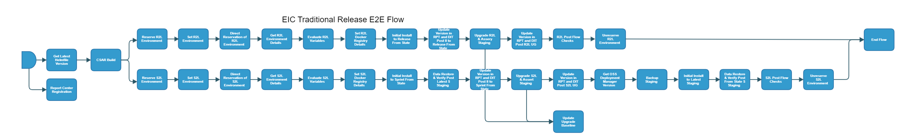

# eiap-traditional-release-e2e-Flow

[TOC]

[eiap-traditional-release-e2e-Flow](https://spinnaker.rnd.gic.ericsson.se/#/applications/eiap-release-e2e-cicd/executions/configure/c16f2691-7562-4275-8e24-1574d9456a00)

## Introduction

The Traditional as a Product (TaaP) deployment loop, which sits to the right of IDUN product staging. The TaaP deployment loop is composed of two main branches:

* `S2L` / Sprint to Latest
* `R2L` / Release to Latest

The purpose of these two separate loops is to protect the integrity of upgrade from a release version to each subsequent latest version, as well as the integrity of a sprint version to each subsequent latest version. This will make software releases less prone to failure due to some customers having longer gaps between upgrades.

If the `S2L` flag is set to true, a Test Environment will be Reserved in [RPT](https://rpt.ews.gic.ericsson.se/) and it's details will automatically be retrieved and used for the `S2L` branch of the pipeline. The same is true for the `R2L` flag, the test environment will be reserved and information retrieved will be used for the `R2L` branch. One or both of these branches can be enabled for an execution.

At the moment there are no automatic triggers for the release pipeline, it's triggered manually only. The wanted position is `S2L`, `R2L` & `II/BUR` pipelines are run automatically as frequently as possible.

After each II and UG stage in the pipeline, if the `II/UG` is successful, the version will be updated in RPT to track it.

>**Traditional as a Product (TaaP)** is a software distribution model in which a software provider releases the software to the customer as per the frequency agreed.

* * *

## Pre-requisite

1. EIAP Test Environment is added to DIT.
2. EIAP Test Environment is updated in DIT and RPT (for version) to house specific data needed for CICD function, please use the following jobs:
    1. [Update-Environment-Details](https://fem5s11-eiffel216.eiffel.gic.ericsson.se:8443/jenkins/job/RPT-RC_Update-Environment-Details/)
    2. [DSC-DIT-Update-Key-Value-Pairs/](https://fem5s11-eiffel216.eiffel.gic.ericsson.se:8443/jenkins/job/DSC-DIT-Update-Key-Value-Pairs/)
3. EIAP Test Environment has a backup directory created on remote SFTP.
4. EIAP Test Environment has any necessary files ready for any specific CICD function. e.g. [oss-release-io-solution](/README.md) repo for observability, kube configs stored in Jenkins for II/UG etc.

* * *

## Pipeline Parameters

| Parameter | Description |
|-----|-----|
| S2L | Enable S2L Flow for this execution. |
| S2L_TEST_ENVIRONMENT | Please leave this field blank if you want to Reserve a Test Environment from the pool. The Test Environment to use for the S2L flow. |
| R2L | Enable R2L Flow for this execution. |
| R2L_TEST_ENVIRONMENT | Please leave this field blank if you want to Reserve a Test Environment from the pool. The Test Environment to use for the R2L flow. |
| USE_REAL_CSAR | Option to use real CSAR. If false then dummy CSAR will be used |
| TAGS | List of tags for applications that have to be deployed |
| DOCKER_REGISTRY | Set this to the docker registry to execute the deployment from. Used when deploying from Officially Released CSARs |
| DOCKER_REGISTRY_CREDENTIALS | Jenkins secret ID for the Docker Registry. Not needed if deploying from armdocker.rnd.ericsson.se |
| INT_CHART_VERSION | Version of the Integration Chart which will be used during Install / Upgrade |
| DEPLOYMENT_MANAGER_REPO | Deployment Manager Repository. |
| DEPLOYMENT_MANAGER_VERSION | Deployment Manager version. |
| K6_VERSION | K6 version |
| USE_DM_PREPARE | When set to true uses the site values generated from the Deployment Manager prepare command for the deployment. |
| RSR_TAG | RSR Tag is used to identify the environment by Report Center Registration Stage for Release stage |
| DDP_AUTO_UPLOAD | When set to true, enables the DDP auto upload |
| CLEANUP_TYPE | The Type of cleanup that needs to be done. FULL will cleanup the deployment helm releases, crd helm releases, crd components, clusterroles, cluster rolebindings, namespaces (deployment and crd). Where as PARTIAL will only cleanup the deployment namespace. FULL cleanup option should NOT be used in such cases where single cluster is hosting multiple deployments. |
| RUN_ENM_INTEGRATION_TEST | When set to true, ENM integration tests will be run |
| USE_CERTM | Set to true to use the "--use-certm" tag during the deployment |
| PATH_TO_TO_STATE_SITE_VALUE_FILE | The path to to state site values file, setting this param overrides the value taken from RPT. |
 * * *

## Pipeline stages
>
>## Initial Common stages
>
### Report Center Registration

This stage runs a Jenkins job [Staging-Report-Register](https://fem4s11-eiffel216.eiffel.gic.ericsson.se:8443/jenkins/job/Staging-Report-Register) (Regulus owned Jenkins job).

#### Description

 This stage sends the pipeline execution ID for logging and monitoring.

 * * *

### Get Latest Helmfile Version

This stage runs a Jenkins job [Get-Latest-ChartOrHelmfile](https://fem5s11-eiffel052.eiffel.gic.ericsson.se:8443/jenkins/job/Get-Latest-ChartOrHelmfile)

#### Description

Retrieves the latest chart or helmfile and sets the `INT_CHART_VERSION` for downstream use.
 * * *

### CSAR Build

This stage runs a spinnaker pipeline [eiap-release-csar-build-flow](https://spinnaker.rnd.gic.ericsson.se/#/applications/eiap-release-e2e-cicd/executions/configure/c187f4db-555a-4a9a-a331-6dfdc79a5b97) (Thunderbee owned pipeline) [Pipeline Documentation](/cicd_pipelines_documentation_and_diagrams/release/common_release_child_flows/documentation/eiap_release_csar_build_flow.md).

#### Description

* This pipeline calls the "oss-csar-build-flow" pipeline to build CSARs to be included in EIAP.
* The CSAR Build stage runs only if the `USE_REAL_CSAR` parameter is set to `True` (Set to `False` by default).
* This stage is disabled by default because using the build CSAR test coverage is being handled in the [CaaP loop (MANA loop)](/cicd_pipelines_documentation_and_diagrams/release/caap_parent_flow/documentation/eiap_connected_release_e2e_flow.md).

 * * *

>## Release to Latest (R2L) Branch

### Reserve R2L Environment

This stage runs a Jenkins job [RPT-RC_Reserve-Environment](https://fem5s11-eiffel216.eiffel.gic.ericsson.se:8443/jenkins/job/RPT-RC_Reserve-Environment) (Thunderbee owned Jenkins job).

#### Description

This Job implements a function to Reserve a Test Environment in RPT.
 * * *

### Set R2L Test Environment

This stage evaluates variables to be referenced downstream.

#### Description

This stage evaluates:

* RESOURCE_NAME

* * *

### Direct Reservation of R2L Environment

This stage runs a Jenkins job [RPT-RC_Update-Test-Environment-Status](https://fem5s11-eiffel216.eiffel.gic.ericsson.se:8443/jenkins/job/RPT-RC_Update-Test-Environment-Status) (Thunderbee owned Jenkins job).

#### Description

This Stage runs a Jenkins job to update the status of a Test Environment in RPT to Reserved.
 * * *

### Get R2L Environment Details

This stage runs a Spinnaker pipeline [eiap-release-get-environment-details-flow](https://spinnaker.rnd.gic.ericsson.se/#/applications/eiap-release-e2e-cicd/executions/configure/6e9b836e-b8da-4324-a87e-4a1f3cde6ac1) (Thunderbee owned pipeline). [Pipeline Documentation](/cicd_pipelines_documentation_and_diagrams/release/taap_release_child_flows/documentation/eiap_release_get_environment_details_flow.md)

#### Description

This stage retrieves Test Environment specific values from RPT.
 * * *

### Evaluate R2L Variables

This stage evaluates variables to be referenced downstream.

#### Description

This stage evaluates:

* PATH_TO_TO_STATE_SITE_VALUES_OVERRIDE_FILE_R2L
* PATH_TO_FROM_STATE_SITE_VALUES_OVERRIDE_FILE_R2L
* PATH_TO_TO_STATE_SITE_VALUES_FILE_R2L
* SKIP_TESTS_R2L
* RUN_TESTS_R2L
* ECM_HOSTNAME_R2L
* ENM_HOSTNAME_R2L

 * * *

### Set R2L Docker Registry Details

This stage evaluates variables to be referenced downstream.

#### Description

This stage evaluates:

* DOCKER_REGISTRY_R2L
* DOCKER_REGISTRY_CREDENTIALS_R2L

 * * *

### Initial Install to Release From State

This stage runs a spinnaker pipeline [eiap-release-install-flow](https://spinnaker.rnd.gic.ericsson.se/#/applications/eiap-release-e2e-cicd/executions/configure/9586d39d-db4d-40d8-a691-1178c766f65c) (Thunderbee owned pipeline) [Pipeline Documentation](/cicd_pipelines_documentation_and_diagrams/release/common_release_child_flows/documentation/eiap_release_upgrade_flow.md).

#### Description

This stage performs an install to the Release From State.
 * * *

### Update Version in RPT and DIT Post II to Release From State

This stage runs a spinnaker pipeline [eiap-release-update-version-flow](https://spinnaker.rnd.gic.ericsson.se/#/applications/eiap-release-e2e-cicd/executions/configure/73d3e805-7a92-4ec3-9f73-ad18d1432a2f) (Thunderbee owned pipeline) [Pipeline Documentation](/cicd_pipelines_documentation_and_diagrams/release/common_release_child_flows/documentation/eiap_release_upgrade_flow.md).

#### Description

This stage updates the Environments `INT_CHART_VERSION` in RPT.
 * * *

### Upgrade R2L & Assert_Staging

This stage runs a spinnaker pipeline [eiap-release-upgrade-flow](https://spinnaker.rnd.gic.ericsson.se/#/applications/eiap-release-e2e-cicd/executions/configure/59c0789e-51e9-4e5d-9387-53e276cda158) (Thunderbee owned pipeline) [Pipeline Documentation](/cicd_pipelines_documentation_and_diagrams/release/common_release_child_flows/documentation/eiap_release_upgrade_flow.md).

#### Description

This Pipeline performs the steps necessary for an Upgrade of EIAP Environment.
This stage is followed by the [Update Upgrade Baseline](#update-upgrade-baseline) stage.
 * * *

### Update Version in RPT and DIT Post R2L UG

This stage runs a spinnaker pipeline [eiap-release-update-version-flow](https://spinnaker.rnd.gic.ericsson.se/#/applications/eiap-release-e2e-cicd/executions/configure/73d3e805-7a92-4ec3-9f73-ad18d1432a2f) (Thunderbee owned pipeline) [Pipeline Documentation](/cicd_pipelines_documentation_and_diagrams/release/common_release_child_flows/documentation/eiap_release_update_version_flow.md).

#### Description

This stage updates the Environments `INT_CHART_VERSION` in RPT.
 * * *

### R2L Post Flow Checks

This checks preconditions before continuing.

#### Description

This checks:

* "Get R2L Environment Details" is `SUCCEEDED` or `SKIPPED`
* "Upgrade R2L & Assert_Staging" is `SUCCEEDED` or `SKIPPED`
* "Initial Install to Release From State" is `SUCCEEDED` or `SKIPPED`

 * * *

### Unreserve R2L Environment

This stage runs a Jenkins job [RPT-RC_Unreserve-Environment](https://fem5s11-eiffel216.eiffel.gic.ericsson.se:8443/jenkins/job/RPT-RC_Unreserve-Environment) (Thunderbee owned Jenkins job).

#### Description

This Job implements a function to Unreserve a Test Environment in RPT.
 * * *

>## Sprint to Latest (S2L) Branch

### Reserve S2L Environment

This stage runs a Jenkins job [RPT-RC_Reserve-Environment](https://fem5s11-eiffel216.eiffel.gic.ericsson.se:8443/jenkins/job/RPT-RC_Reserve-Environment) (Thunderbee owned Jenkins job).

#### Description

This Job implements a function to reserve a Test Environment in RPT.
 * * *

### Set S2L Test Environment

This stage evaluates variables to be referenced downstream.

#### Description

This stage evaluates:

* RESOURCE_NAME

 * * *

### Direct Reservation of S2L Environment

This stage runs a Jenkins job [RPT-RC_Update-Test-Environment-Status](https://fem5s11-eiffel216.eiffel.gic.ericsson.se:8443/jenkins/job/RPT-RC_Update-Test-Environment-Status) (Thunderbee owned Jenkins job).

#### Description

This Job is to update the status of a Test Environment in RPT.
 * * *

### Get S2L Environment Details

This stage runs a Spinnaker pipeline [eiap-release-get-environment-details-flow](https://spinnaker.rnd.gic.ericsson.se/#/applications/eiap-release-e2e-cicd/executions/configure/6e9b836e-b8da-4324-a87e-4a1f3cde6ac1) (Thunderbee owned pipeline). [Pipeline Documentation](/cicd_pipelines_documentation_and_diagrams/release/taap_release_child_flows/documentation/eiap_release_get_environment_details_flow.md)

#### Description

This stage retrieves Test Environment specific values from RPT.
 * * *

### Evaluate S2L Variables

This stage evaluates variables to be referenced downstream.

#### Description

This stage evaluates:

* PATH_TO_TO_STATE_SITE_VALUES_OVERRIDE_FILE_S2L
* PATH_TO_FROM_STATE_SITE_VALUES_OVERRIDE_FILE_S2L
* PATH_TO_TO_STATE_SITE_VALUES_FILE_S2L
* SKIP_TESTS_S2L
* RUN_TESTS_S2L
* ECM_HOSTNAME_S2L
* ENM_HOSTNAME_S2L

 * * *

### Set S2L Docker Registry Details

This stage evaluates variables to be referenced downstream.

#### Description

This stage evaluates:

* DOCKER_REGISTRY_S2L
* DOCKER_REGISTRY_CREDENTIALS_S2L

 * * *

### Initial Install to Sprint From State

This stage runs a spinnaker pipeline [eiap-release-install-flow](https://spinnaker.rnd.gic.ericsson.se/#/applications/eiap-release-e2e-cicd/executions/configure/9586d39d-db4d-40d8-a691-1178c766f65c) (Thunderbee owned pipeline) [Pipeline Documentation](/cicd_pipelines_documentation_and_diagrams/release/common_release_child_flows/documentation/eiap_release_install_flow.md).

#### Description

This stage performs an install to the Sprint From State.
 * * *

### Data Restore & Verify Post From State S_Staging

This stage runs a spinnaker pipeline [eiap-release-data-restore-and-verify-flow](https://spinnaker.rnd.gic.ericsson.se/#/applications/eiap-release-e2e-cicd/executions/configure/419149fd-78da-4089-bbee-e22cc094e2f2) (Thunderbee owned pipeline) [Pipeline Documentation](/cicd_pipelines_documentation_and_diagrams/release/taap_release_child_flows/documentation/eiap_release_data_restore_and_verify_flow.md).

#### Description

This stage backs up and restore data using the EIAP Release data Restore and Verify flow linked above.
* * *

### Update Version in RPT and DIT Post II to Sprint From State

This stage runs a spinnaker pipeline [eiap-release-update-version-flow](https://spinnaker.rnd.gic.ericsson.se/#/applications/eiap-release-e2e-cicd/executions/configure/73d3e805-7a92-4ec3-9f73-ad18d1432a2f) (Thunderbee owned pipeline) [Pipeline Documentation](/cicd_pipelines_documentation_and_diagrams/release/common_release_child_flows/documentation/eiap_release_update_version_flow.md).

#### Description

This Stage updates the Environments `INT_CHART_VERSION` in RPT.
* * *

### Upgrade S2L & Assert_Staging

This stage runs a spinnaker pipeline [eiap-release-upgrade-flow](https://spinnaker.rnd.gic.ericsson.se/#/applications/eiap-release-e2e-cicd/executions/configure/59c0789e-51e9-4e5d-9387-53e276cda158) (Thunderbee owned pipeline) [Pipeline Documentation](/cicd_pipelines_documentation_and_diagrams/release/common_release_child_flows/documentation/eiap_release_upgrade_flow.md).

#### Description

This Pipeline performs the steps necessary for an Upgrade of EIAP Environment.
This stage is followed by the [Update Upgrade Baseline](#update-upgrade-baseline) stage.
 * * *

### Update Version in RPT and DIT Post S2L UG

This stage runs a spinnaker pipeline [eiap-release-update-version-flow](https://spinnaker.rnd.gic.ericsson.se/#/applications/eiap-release-e2e-cicd/executions/configure/73d3e805-7a92-4ec3-9f73-ad18d1432a2f) (Thunderbee owned pipeline) [Pipeline Documentation](/cicd_pipelines_documentation_and_diagrams/release/common_release_child_flows/documentation/eiap_release_update_version_flow.md).

#### Description

This stage updates the Environments `INT_CHART_VERSION` in RPT.
 * * *

### Get OSS Deployment Manager Version

This stage evaluates variables to be referenced downstream.

#### Description

This stage evaluates:

* DEPLOYMENT_MANAGER_VERSION

 * * *

### Backup_Staging

This stage runs a spinnaker pipeline [eiap-release-backup-flow](https://spinnaker.rnd.gic.ericsson.se/#/applications/eiap-release-e2e-cicd/executions/configure/5b07fdbe-a832-4ff3-baa1-946a90c8b610) (Thunderbee owned pipeline) [Pipeline Documentation](/cicd_pipelines_documentation_and_diagrams/release/taap_release_child_flows/documentation/eiap_release_backup_flow.md).

#### Description

This pipeline performs a Backup and Export of of IDUN data.
 * * *

### Initial Install to Latest_Staging

This stage runs a spinnaker pipeline [eiap-release-install-flow](https://spinnaker.rnd.gic.ericsson.se/#/applications/eiap-release-e2e-cicd/executions/configure/9586d39d-db4d-40d8-a691-1178c766f65c) (Thunderbee owned pipeline) [Pipeline Documentation](/cicd_pipelines_documentation_and_diagrams/release/common_standalone_flows/documentation/eiap_traditional_release_install_flow.md).

#### Description

This stage performs an install to the latest green staging baseline version.
 * * *

### Data Restore & Verify Post Latest S_Staging

This stage runs a spinnaker pipeline [eiap-release-data-restore-and-verify-flow](https://spinnaker.rnd.gic.ericsson.se/#/applications/eiap-release-e2e-cicd/executions/configure/419149fd-78da-4089-bbee-e22cc094e2f2) (Thunderbee owned pipeline) [Pipeline Documentation](/cicd_pipelines_documentation_and_diagrams/release/taap_release_child_flows/documentation/eiap_release_data_restore_and_verify_flow.md).

#### Description

This stage backs up and restore data using the EIAP Release data Restore and Verify flow linked above.
 * * *

### S2L Post Flow Checks

This checks preconditions before continuing.

#### Description

This checks

* "Get S2L Environnement Details" is `SUCCEEDED` or `SKIPPED`
* "Upgrade S2L & Assert_Staging" is `SUCCEEDED` or `SKIPPED`
* "Initial Install to Sprint From State" is `SUCCEEDED` or `SKIPPED`
* "Backup_Staging" is `SUCCEEDED` or `SKIPPED`
* "Initial Install to Latest_Staging" is `SUCCEEDED` or `SKIPPED`
* "Data Restore & Verify Post Latest S_Staging" is `SUCCEEDED` or `SKIPPED`
* "Data Restore & Verify Post From State S_Staging" is `SUCCEEDED` or `SKIPPED`

 * * *

### Unreserve S2L Environment

This stage runs a Jenkins job [RPT-RC_Unreserve-Environment](https://fem5s11-eiffel216.eiffel.gic.ericsson.se:8443/jenkins/job/RPT-RC_Unreserve-Environment) (Thunderbee owned Jenkins job).

#### Description

This Job implements a function to Unreserve a Test Environment in RPT.
 * * *

>## Common Stages
>
### Update Upgrade Baseline

This stage runs a Spinnaker pipeline [eiap-release-check-baseline-version-and-update-flow](https://spinnaker.rnd.gic.ericsson.se/#/applications/eiap-release-e2e-cicd/executions/configure/80abc630-5d75-45a1-89a1-071471332494) (Thunderbee owned pipeline)  [Pipeline Documentation](/cicd_pipelines_documentation_and_diagrams/release/taap_release_child_flows/documentation/eiap_release_check_baseline_version_and_update_flow.md).

#### Description

The "eiap-release-check-baseline-version-and-update-flow" pipeline is a Spinnaker pipeline that is used to manage the Upgrade baseline version for the EIAP release process. The pipeline is responsible for the following tasks:

1. Retrieve the Upgrade baseline version currently stored in the [baseline-versions](https://gerrit-gamma.gic.ericsson.se/plugins/gitiles/OSS/com.ericsson.oss.cicd/baseline-versions/+/refs/heads/master/versions.json) repository.
2. Compare the retrieved version with the version used for a successful Upgrade in the "eiap-traditional-release-e2e-Flow" pipeline.
3. Update the Upgrade baseline version stored in the repository, if appropriate.
The "Update Upgrade Baseline" stage of the pipeline will only execute under the following conditions:

Both `R2L` and `S2L` branches of the "EIAP Traditional Release E2E Flow" pipeline have executed and Upgrade has been successful in both branches.
Either `R2L` or `S2L` branches have executed and the Upgrade in that executing branch has been successful.
 * * *

### End Flow

Checks preconditions for successful execution of the pipeline.
 * * *
