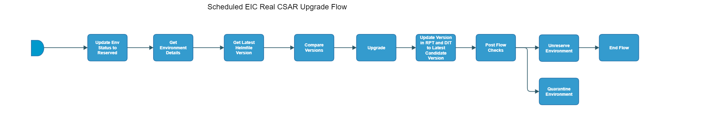

[TOC]

# Scheduled_eic-real-csar-upgrade-flow

[Scheduled_eic-real-csar-upgrade-flow](https://spinnaker.rnd.gic.ericsson.se/#/applications/eic-release-e2e-cicd/executions/configure/f2f85dab-6b83-4aa5-935d-32a8b4bf2a53)
## Introduction:
This pipeline is a Scheduled Standalone pipeline which performs an install/upgrade of EIC software on a Test Environment

This pipeline runs everyday at 6am, 12pm and 6pm via the "eic-real-csar-upgrade" schedule in [RPT](https://rpt.ews.gic.ericsson.se/#/schedules).
 * * *

## Pipeline Parameters:
| Parameter | Description |
|-----|-----|
| ENV_NAME | Name of the deployment. |
| DDP_AUTO_UPLOAD | When set to true, enables the DDP auto upload. |
| DEPLOYMENT_MANAGER_REPO | Deployment Manager Repository (for internal Upgrade only). |
| OSS_DEPLOYMENT_MANAGER_VERSION | The version of Deployment Manager to use. |
| INTERNAL_AGENT_NAME | Specify the internal Jenkins agent that you want the job to run on. |
| INT_CHART_NAME | Name of the integration chart which will be used for the Initial install |
| INT_CHART_REPO | Repo of the Integration Chart which will be used for the Initial Install |
* * *
## Pipeline Stages

### Update Env Status to Reserved:
This stage runs a Jenkins job [RPT-RC_Update-Test-Environment-Status](https://fem5s11-eiffel216.eiffel.gic.ericsson.se:8443/jenkins/job/RPT-RC_Update-Test-Environment-Status) (Thunderbee owned Jenkins job).

#### Description:
This Job is to update the status of a Test Environment in RPT.

 * * *
### Get Environment Details:
This stage runs a Jenkins Job [DSC-DIT-Download-Document-As-Artifact](https://fem5s11-eiffel216.eiffel.gic.ericsson.se:8443/jenkins/job/DSC-DIT-Download-Document-As-Artifact) (Thunderbee owned Jenkins job).

#### Description:
This Job is used to retrieve the properties of a Test Environment from DIT.

 * * *
### Get Latest Helmfile Version:
This stage runs a Jenkins job [Get-Latest-ChartOrHelmfile](https://fem5s11-eiffel052.eiffel.gic.ericsson.se:8443/jenkins/job/Get-Latest-ChartOrHelmfile) (Ticketmaster/Honeypot owned Jenkins job).

#### Description:
This job gets the latest chart or Helmfile version.
This is passed back into the pipeline as INT_CHART_VERSION

 * * *
### Compare Versions:
This stage runs a Jenkins job [BASE-VERS_Compare_Version_With_Baseline_Version](https://fem5s11-eiffel216.eiffel.gic.ericsson.se:8443/jenkins/job/BASE-VERS_Compare_Version_With_Baseline_Version) (Thunderbee owned Jenkins job).

#### Description:
The job compares a specified version with the baseline version stored in the baseline-versions repo.

 * * *
### Upgrade
This stage runs a Spinnaker pipeline [eic-real-csar-upgrade-flow](https://spinnaker.rnd.gic.ericsson.se/#/applications/eic-release-e2e-cicd/executions/configure/a7d518a3-f0ab-4a20-b68f-932f645f5d33) (Thunderbee owned pipeline).

#### Description:
This pipeline performs an upgrade of EIC software on a Test Environment.
[Pipeline Documentation](../../caap_internal_child_flows/documentation/eic_real_csar_upgrade_flow.md).

 * * *
### Update Version in RPT and DIT to Latest Candidate Version:
This stage runs a Spinnaker pipeline [eic-release-update-version-flow](https://spinnaker.rnd.gic.ericsson.se/#/applications/eic-release-e2e-cicd/executions/configure/c2ef3a0e-65be-45a1-91ac-d8661170dd30) (Thunderbee owned pipeline). [Pipeline Documentation](../../taap_release_child_flows/documentation/eic_release_update_version_flow.md)

#### Description:
If necessary, updates the Upgrade baseline version in the repo, replacing the existing, stored version with the version used in the pipeline.

 * * *
### Post Flow Checks

Checks preconditions for successful execution of the pipeline.

 * * *
### Unreserve Environment:
This stage runs a Jenkins job [RPT-RC_Unreserve-Environment](https://fem5s11-eiffel216.eiffel.gic.ericsson.se:8443/jenkins/job/RPT-RC_Unreserve-Environment) (Thunderbee owned Jenkins job).

#### Description:
This Job implements a function to unreserve a test environment in RPT.

 * * *
### Quarantine Environment:
This stage runs a Jenkins job [RPT-RC_Quarantine-Environment](https://fem5s11-eiffel216.eiffel.gic.ericsson.se:8443/jenkins/job/RPT-RC_Quarantine-Environment) (Thunderbee owned Jenkins job).

#### Description:
This Job implements a function to quarantine a Test Environment in RPT.

 * * *
### End Flow

Checks preconditions for successful execution of the pipeline.
 * * *
