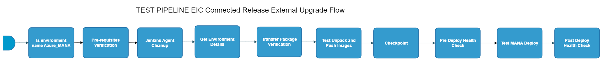

[Pipeline Inoperative]

_This pipeline is currently nonfunctional._

[TOC]
# TEST_PIPELINE-eic-connected-release-external-upgrade-flow

[TEST_PIPELINE-eic-connected-release-external-upgrade-flow](https://spinnaker.rnd.gic.ericsson.se/#/applications/eic-release-e2e-cicd/executions/configure/cf588e38-e45e-45fe-afac-eceaf89f2e3e)
## Introduction:
This pipeline is a standalone pipeline which performs an upgrade of EIC software on a Test Environment. This flow simulates the upgrade of EIC on a customer environment.
 * * *
## Pipeline stages
### Is environment name Azure_MANA
Checks preconditions for the pipeline.
 * * *
### Pre-requisites Verification:
This stage requires a decision by the pipeline operator.
> **_Instructions:_** "Are all pre-requisite done?"
 * * *
### Jenkins Agent Cleanup:
This stage runs a Jenkins job [oss-idun-release-cicd_Jenkins_Agent_Cleanup](https://fem5s11-eiffel052.eiffel.gic.ericsson.se:8443/jenkins/job/oss-idun-release-cicd_Jenkins_Agent_Cleanup) (Thunderbee owned Jenkins job).
#### Description:
This job cleans the agent it is run on.
 * * *
### Get Environment Details:
This stage runs a Jenkins job [DSC-DIT-Download-Document-As-Artifact](https://fem5s11-eiffel216.eiffel.gic.ericsson.se:8443/jenkins/job/DSC-DIT-Download-Document-As-Artifact) (Thunderbee owned Jenkins job).
#### Description:
This Job is to retrieve the properties of a test environment in DIT.
 * * *
### Transfer Package Verification:
This stage requires a decision by the pipeline operator.
> **_Instructions:_** "Please verify if package.tar.gz is available in the DESTINATION_SERVER_PACKAGE_LOCATION provided (default=/tmp)."
 * * *
### Test Unpack and Push Images:
This stage runs a Jenkins job [oss-idun-release-cicd_Unpack_And_Push_Images_Internal_Testing](https://fem5s11-eiffel052.eiffel.gic.ericsson.se:8443/jenkins/job/oss-idun-release-cicd_Unpack_And_Push_Images_Internal_Testing) (Thunderbee owned Jenkins job).
#### Description:
This job is used to push the images to the Conatainer Registry.
 * * *
### Checkpoint:
This stage requires a decision by the pipeline operator.
> **_Instructions:_** "Please press continue"
 * * *
### Pre Deploy Health Check:
This stage runs a Jenkins job [oss-idun-release-cicd_MANA_Health_Check_Internal_Testing](https://fem5s11-eiffel052.eiffel.gic.ericsson.se:8443/jenkins/job/oss-idun-release-cicd_MANA_Health_Check_Internal_Testing) (Thunderbee owned Jenkins job).
#### Description:
This job checks the status of HELM deployments on MANA environments.
 * * *
### Test MANA Deploy:
This stage runs a Jenkins job [oss-idun-release-cicd_MANA_Deploy_Internal_Testing](https://fem5s11-eiffel052.eiffel.gic.ericsson.se:8443/jenkins/job/oss-idun-release-cicd_MANA_Deploy_Internal_Testing) (Thunderbee owned Jenkins job).
#### Description:
This job is used to install/upgrade the EIC on an environment.
 * * *
### Post Deploy Health Check:
This stage runs a Jenkins job [oss-idun-release-cicd_MANA_Health_Check_Internal_Testing](https://fem5s11-eiffel052.eiffel.gic.ericsson.se:8443/jenkins/job/oss-idun-release-cicd_MANA_Health_Check_Internal_Testing) (Thunderbee owned Jenkins job).
#### Description:
This job checks the status of HELM deployments on MANA environments.
