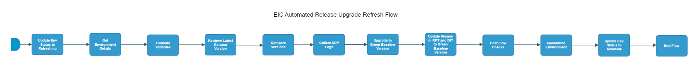

[TOC]

# eic-automated-release-upgrade-refresh-flow

[eic-automated-release-upgrade-refresh-flow](https://spinnaker.rnd.gic.ericsson.se/#/applications/eic-release-e2e-cicd/executions/configure/8f521a18-0cfc-4111-aa17-35118fc923d6)
## Introduction:
This Pipeline performs an automated refresh of Release environments.
It updates an Environment to a Green Baseline Version.

## Pipeline Parameters:
| Parameter | Description |
|-----|-----|
| ENV_NAME | Name of the deployment |
| USE_REAL_CSAR | Option to use real CSAR. If false then dummy CSAR will be used |
| TAGS | List of tags for applications that have to be deployed |
| DOCKER_REGISTRY |  |
| DOCKER_REGISTRY_CREDENTIALS |  |
| NAMESPACE |  |
| DEPLOYMENT_MANAGER_REPO | Deployment Manager Repository. |
| NEW_DM_FROM_STATE | Update the Deployment Manager From State. |
| USE_DM_PREPARE | When set to true uses the site values generated from the Deployment manager prepare command for the deployment. |
| DDP_AUTO_UPLOAD | When set to true, enables the DDP auto upload |
| RUN_ENM_INTEGRATION_TEST | When set to true, ENM integration tests will be run |
 * * *

## Pipeline Stages:

### Update Env Status to Refreshing:
This stage runs a Jenkins job [RPT-RC_Update-Test-Environment-Status](https://fem5s11-eiffel216.eiffel.gic.ericsson.se:8443/jenkins/job/RPT-RC_Update-Test-Environment-Status) (Thunderbee owned Jenkins job).

#### Description:
This Job is to update the status of a Test Environment in RPT.
 * * *
### Get Environment Details:
This stage runs a Jenkins job [DSC-DIT-Download-Document-As-Artifact](https://fem5s11-eiffel216.eiffel.gic.ericsson.se:8443/jenkins/job/DSC-DIT-Download-Document-As-Artifact) (Thunderbee owned Jenkins job).

#### Description:
This Job is to retrieve the properties of a Test Environment in DIT.

 * * *

### Evaluate Variables:
This stage evaluates variables to be referenced downstream

#### Description:
This stage evaluates:

- TO_STATE_SITE_VALUES_OVERRIDE_FILE
- SKIP_TESTS
- RUN_TESTS
- ECM_HOSTNAME
- ENM_HOSTNAME

 * * *
### Retrieve Latest Release Version:
This stage runs a Jenkins job [BASE-VERS_Retrieve_Baseline_Version](https://fem5s11-eiffel216.eiffel.gic.ericsson.se:8443/jenkins/job/BASE-VERS_Retrieve_Baseline_Version) (Thunderbee owned Jenkins job).

#### Description:
 The job retrieves the baseline version from a given versions file.

 * * *
### Compare Versions:
This stage runs a Jenkins job [BASE-VERS_Compare_Version_With_Baseline_Version](https://fem5s11-eiffel216.eiffel.gic.ericsson.se:8443/jenkins/job/BASE-VERS_Compare_Version_With_Baseline_Version) (Thunderbee owned Jenkins job).

#### Description:
 The job compares a specified version with the baseline version stored in the baseline-versions repo.

 * * *
### Collect ADP Logs:
This stage runs a Jenkins job [Get-K8S-Logs](https://fem5s11-eiffel052.eiffel.gic.ericsson.se:8443/jenkins/job/Get-K8S-logs) (Application Staging owned Jenkins job).

#### Description:
 The job retrieves cluster logs that are collected by ADP logs collection script.

 * * *
### Upgrade to Green Baseline Version:
This stage runs a Spinnaker pipeline [eic-release-upgrade-flow](https://spinnaker.rnd.gic.ericsson.se/#/applications/eic-release-e2e-cicd/executions/configure/e6c06ca6-1798-48ae-bc07-6406460db4a2) (Thunderbee owned pipeline). [Pipeline Documentation](/../../cicd_pipelines_documentation_and_diagrams/release/common_release_child_flows/documentation/eic_release_upgrade_flow.md)

#### Description:
This Pipeline performs the steps necessary for an Upgrade of EIC Environment

 * * *
### Update Version in RPT and DIT to Green Baseline Version:
This stage runs a Spinnaker pipeline [eic-release-update-version-flow](https://spinnaker.rnd.gic.ericsson.se/#/applications/eic-release-e2e-cicd/executions/configure/c2ef3a0e-65be-45a1-91ac-d8661170dd30) (Thunderbee owned pipeline). [Pipeline Documentation](/../../cicd_pipelines_documentation_and_diagrams/release/taap_release_child_flows/documentation/eic_release_update_version_flow.md)

#### Description:
If necessary, updates the Upgrade baseline version in the repo, replacing the existing, stored version with the version used in the pipeline.
 * * *
### Post Flow Checks

Checks preconditions for successful execution of the pipeline.
 * * *
### Quarantine Environment:
This stage runs a Jenkins job [RPT-RC_Quarantine-Environment](https://fem5s11-eiffel216.eiffel.gic.ericsson.se:8443/jenkins/job/RPT-RC_Quarantine-Environment) (Thunderbee owned Jenkins job).

#### Description:
This Job implements a function to quarantine a Test Environment in RPT.

 * * *
### Update Env Status to Available:
This stage runs a Jenkins job [RPT-RC_Update-Test-Environment-Status](https://fem5s11-eiffel216.eiffel.gic.ericsson.se:8443/jenkins/job/RPT-RC_Update-Test-Environment-Status) (Thunderbee owned Jenkins job).

#### Description:
This Job is to update the status of a Test Environment in RPT.

 * * *
### End Flow

Checks preconditions for successful execution of the pipeline.
 * * *
