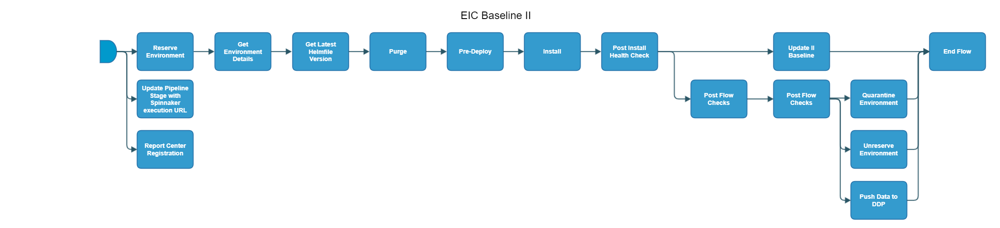

[TOC]

# Scheduled_eic-baseline-II / Scheduled_eic-II-loop

[Scheduled_eic-baseline-II](https://spinnaker.rnd.gic.ericsson.se/#/applications/eic-release-e2e-cicd/executions/configure/6388f1c9-9db7-4bf1-9504-7825463fa2be)

[Scheduled_eic-II-loop](https://spinnaker.rnd.gic.ericsson.se/#/applications/eic-release-e2e-cicd/executions/configure/7f1b3550-938e-446c-a2fe-58ada7c72705)

> **_NOTE:_**
Previously eic-traditional-release-install-flow

## Introduction:
This pipeline is a template for a Standalone Install Pipeline.
It can do a `FULL` or `PARTIAL` clean down of an Environment and performs a clean install of EIC.

## Pipeline Parameters:
| Parameter | Description |
|-----|-----|
| ENV_NAME | Name of the deployment |
| USE_REAL_CSAR | Option to use real CSAR. If false then dummy CSAR will be used |
| INT_CHART_NAME | Name of the integration chart which will be used for the Initial install |
| INT_CHART_VERSION | Version of the Integration Chart which will be used for the Initial Install |
| INT_CHART_REPO | Repo of the Integration Chart which will be used for the Initial Install |
| DEPLOYMENT_MANAGER_REPO | Deployment Manager Repository. |
| DEPLOYMENT_MANAGER_VERSION | Deployment Manager version. |
| USE_DM_PREPARE | When set to true uses the site values generated from the Deployment manager prepare command for the deployment. |
| SITE_VALUES_FILE | Site values datafile stored in OST. |
| RSR_TAG | RSR Tag is used to identify the environment by Report Center Registration Stage for Release stage |
| DDP_AUTO_UPLOAD | When set to true, enables the DDP auto upload |
| CLEANUP_TYPE | The Type of cleanup that needs to be done. FULL will cleanup the deployment helm releases, crd helm releases, crd components, clusterroles, cluster rolebindings, namespaces (deployment and crd). Where as PARTIAL will only cleanup the deployment namespace. FULL cleanup option should NOT be used in such cases where single cluster is hosting multiple deployments. |
 * * *

## Pipeline Stages:

### Report Center Registration:
This stage runs a Jenkins job [Staging-Report-Register](https://fem4s11-eiffel216.eiffel.gic.ericsson.se:8443/jenkins/job/Staging-Report-Register) (Regulus owned Jenkins job).

#### Description:
This stage sends the pipeline execution ID for logging and monitoring
 * * *
### Reserve Environment:
This stage runs a Jenkins job [RPT-RC_Update-Test-Environment-Status](https://fem5s11-eiffel216.eiffel.gic.ericsson.se:8443/jenkins/job/RPT-RC_Update-Test-Environment-Status) (Thunderbee owned Jenkins job).

#### Description:
This Job is to update the status of a Test Environment in RPT.
 * * *
### Update Pipeline Stage with Spinnaker execution URL:
This stage runs a Jenkins job [RPT-RC_Update-PipelineStage](https://fem5s11-eiffel216.eiffel.gic.ericsson.se:8443/jenkins/job/RPT-RC_Update-PipelineStage) (Thunderbee owned Jenkins job).

#### Description:
This Job implements a function to update the Pipeline Stage of test environment in RPT.
 * * *
### Get Environment Details:
This stage runs a Spinnaker pipeline [eic-release-get-environment-details-flow](https://spinnaker.rnd.gic.ericsson.se/#/applications/eic-release-e2e-cicd/executions/configure/0d236ab2-bce0-4d4a-807d-0ccb638d4ce7) (Thunderbee owned pipeline). [Pipeline Documentation](/../../cicd_pipelines_documentation_and_diagrams/release/taap_release_child_flows/documentation/eic_release_get_environment_details_flow.md)

#### Description:
Performs Operations to reserve an Environment in RPT, Quarantines Environment if the Post Flow checks Fails

 * * *

### Get Latest Helmfile Version:
This stage runs a Jenkins job [Get-Latest-ChartOrHelmfile](https://fem5s11-eiffel052.eiffel.gic.ericsson.se:8443/jenkins/job/Get-Latest-ChartOrHelmfile) (Ticketmaster owned Jenkins job).

#### Description:
Used to get the latest chart or Helmfile.

 * * *
### Purge:
This stage runs a Jenkins job [Purge-Release-in-Namespace](https://fem5s11-eiffel052.eiffel.gic.ericsson.se:8443/jenkins/view/TicketMaster/job/Purge-Release-in-Namespace) (Ticketmaster owned Jenkins job).

#### Description:
This job used to remove any old helm charts and PVC's from a given namespace.
 * * *
### Pre-Deploy:
This stage runs a Spinnaker pipeline [IDUN-Pre-Deployment](https://spinnaker.rnd.gic.ericsson.se/#/applications/common-e2e-cicd/executions/configure/88012023-7839-4eca-92f4-f87715ed77ad) (Ticketmaster owned pipeline).

#### Description:
This pipeline performs pre-requisites before starting the deployment of EIC

 * * *
### Install:
This stage runs a Jenkins job [helmfile-deploy](https://fem5s11-eiffel052.eiffel.gic.ericsson.se:8443/jenkins/job/helmfile-deploy) (Ticketmaster owned Jenkins job).

#### Description:
Performs the Install
Checks the status of the Deployment using HELM

 * * *
### Post Install Health Check:
This stage runs a Jenkins job [OSS-Integration-HealthCheck-Using-DM](https://fem5s11-eiffel052.eiffel.gic.ericsson.se:8443/jenkins/job/OSS-Integration-HealthCheck-Using-DM) (Ticketmaster owned Jenkins job).

#### Description:
Executes a health check against the Test Environment after an install

 * * *
### Update II Baseline:
This stage runs a Spinnaker pipeline [eic-release-check-baseline-version-and-update-flow](https://spinnaker.rnd.gic.ericsson.se/#/applications/eic-release-e2e-cicd/executions/configure/cc89af18-2f3c-4a6b-b27e-c37856c2a08a) (Thunderbee owned pipeline)  [Pipeline Documentation](/cicd_pipelines_documentation_and_diagrams/release/taap_release_child_flows/documentation/eic_release_check_baseline_version_and_update_flow.md).

#### Description:
Checks if installed version of this pipeline execution is greater than the current II Baseline.
If its greater it updates the current II Baseline
Runs only if enabled in the pipeline configuration `Scheduled_eic-II-loop` has id disabled while `Scheduled_eic-baseline-II` has it enabled.

 * * *
### Run k6 Tests & Assert:
This stage runs a Spinnaker pipeline [IDUN_Prod_Eng_K6_single_iteration_release](https://spinnaker.rnd.gic.ericsson.se/#/applications/banba/executions/configure/e908f29c-e1ac-4df5-a8e3-0cae7a426efe) (Banba owned pipeline).

#### Description:
Runs K6 Tests against [eric-oss-product-engineering|https://gerrit-gamma.gic.ericsson.se/plugins/gitiles/OSS/com.ericsson.oss.productEngineering/eric-oss-product-engineering]

 * * *
### Post Flow Checks

Checks preconditions for successful execution of the pipeline.
 * * *
### Quarantine Environment:
This stage runs a Jenkins job [RPT-RC_Quarantine-Environment](https://fem5s11-eiffel216.eiffel.gic.ericsson.se:8443/jenkins/job/RPT-RC_Quarantine-Environment) (Thunderbee owned Jenkins job).
#### Description:
This Job implements a function to quarantine a Test Environment in RPT.
 * * *
### Unreserve Environment:
This stage runs a Jenkins job [RPT-RC_Unreserve-Environment](https://fem5s11-eiffel216.eiffel.gic.ericsson.se:8443/jenkins/job/RPT-RC_Unreserve-Environment) (Thunderbee owned Jenkins job).

#### Description:
This Job implements a function to unreserve a Test Environment in RPT.

* * *
### Push Data to DDP:
This stage runs a Jenkins job [CICD-UTILS-DDP-Upload](https://fem5s11-eiffel052.eiffel.gic.ericsson.se:8443/jenkins/job/CICD-UTILS-DDP-Upload/) (Thunderbee owned Jenkins job).

#### Description:
This job will execute the necessary logic to push environment data to DDP before running an Install

 * * *
### End Flow

Checks preconditions for successful execution of the pipeline.
 * * *

