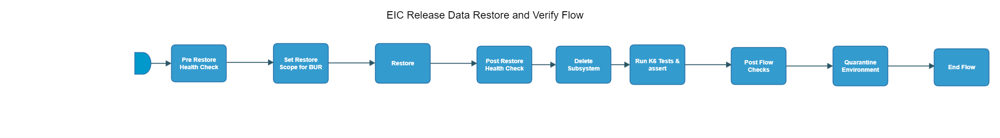

[TOC]

# eic-release-data-restore-and-verify-flow

[eic-release-data-restore-and-verify-flow](https://spinnaker.rnd.gic.ericsson.se/#/applications/eic-release-e2e-cicd/executions/configure/577168a6-5bad-4f42-931a-61806f2b1d9e)
## Introduction:
Data Restore and Verify Flow.

## Pipeline Parameters:
| Parameter | Description |
|-----|-----|
| DEPLOYMENT_MANAGER_VERSION | The version of Deployment Manager to use |
| NAMESPACE | Namespace of environment |
| KUBECONFIG_FILE | Kubernetes configuration file to specify which environment to install on (Datafile name is OST) |
| VNFM_HOSTNAME | Hostname for VNFM |
| SFTP_CREDENTIALS_ID | Credentials for SFTP |
| SFTP_SERVER_PATH | Server path of SFTP |
| INT_CHART_VERSION | The version of EIC chart version needed to be displayed in the EIC release dashboard |
| CLEANUP_SFTP |  |
| DEPLOYMENT_NAME | Name of the deployment |
| GAS_HOSTNAME | Hostname for GAS |
| ADC_HOSTNAME | Hostname for ADC |
| APPMGR_HOSTNAME | Hostname for APPMGR |
| BDR_HOSTNAME | Hostname for BDR |
| EIC_HOSTNAME | Hostname for EIC |
| TH_HOSTNAME | Hostname for TH |
| ECM_HOSTNAME | Hostname for ECM |
| ENM_HOSTNAME | Hostname for ENM |
| SKIP_TESTS | Skips given test scenarios e.g. CANARY_UPGRADE_01, CANARY_UPGRADE_03 |
| RUN_TESTS | Run given tests scenarios and nothing else e.g. CANARY_UPGRADE_01, CANARY_UPGRADE_03 |
| CONFIG_FILES | By default these tests will run e.g., ['main_multiple_iterations.json', 'main_single_iteration.json', 'main_CU2.json'] Override it if needed |
| K6_TESTWARE_VERSION | The version of the K6 testware to be used |
| RUN_ENM_INTEGRATION_TEST | When set to true, ENM integration tests will be run |
| IAM_HOSTNAME | Hostname for IAM |
| KUBE_CONFIG_FILE_CREDENTIAL_ID | Kubernetes configuration file to specify which environment to install on (Jenkins  Credential ID) |
 * * *

## Pipeline Stages:

### Pre Restore Health Check:
This stage runs a Jenkins job [OSS-Integration-HealthCheck-Using-DM](https://fem5s11-eiffel052.eiffel.gic.ericsson.se:8443/jenkins/job/OSS-Integration-HealthCheck-Using-DM) (Ticketmaster owned Jenkins job).

#### Description:
Executes a health check against the Test Environment.

 * * *
### Set Restore Scope for BUR:
This stage runs a Jenkins job [Compare_Deployment_Manager_Version_for_BUR](https://fem5s11-eiffel052.eiffel.gic.ericsson.se:8443/jenkins/job/Compare_Deployment_Manager_Version_for_BUR/) (Laika owned Jenkins job).

#### Description:
This Jenkins Job determines the value of the `BACKUP_SCOPE` property based on a comparison between two parameters, `DEPLOYMENT_MANAGER_VERSION` and `MIN_VERSION`. The result of the comparison is then written to artifact.properties to be used in the Backup Stage.
 * * *
### Restore:
This stage runs a Jenkins job [EO_BUR_Run_Backup](https://fem5s11-eiffel052.eiffel.gic.ericsson.se:8443/jenkins/job/EO_BUR_Run_Backup) (Ticketmaster owned Jenkins job).

#### Description:
Runs a Backup and Restore of data

 * * *
### Post Restore Health Check:
This stage runs a Jenkins job [OSS-Integration-HealthCheck-Using-DM](https://fem5s11-eiffel052.eiffel.gic.ericsson.se:8443/jenkins/job/OSS-Integration-HealthCheck-Using-DM) (Ticketmaster owned Jenkins job).

#### Description:
Checks the status of the Deployment using HELM

 * * *
### Delete Subsystem:
This stage runs a Jenkins job [EIAP_Prod_Eng_integration_suite](https://fem5s11-eiffel052.eiffel.gic.ericsson.se:8443/jenkins/job/EIAP_Prod_Eng_integration_suite/) (Banba owned Jenkins job).

#### Description:
This job runs the integration setup product engineering testware

* * *
### Run k6 Tests & Assert:
This stage runs a Spinnaker pipeline [IDUN_Prod_Eng_K6_single_iteration_release](https://spinnaker.rnd.gic.ericsson.se/#/applications/banba/executions/configure/e908f29c-e1ac-4df5-a8e3-0cae7a426efe) (Banba owned pipeline).

#### Description:
Performs K6 Tests

 * * *
### Post Flow Checks

Checks preconditions for successful execution of the pipeline.
 * * *
### Quarantine Environment:
This stage runs a Jenkins job [RPT-RC_Quarantine-Environment](https://fem5s11-eiffel216.eiffel.gic.ericsson.se:8443/jenkins/job/RPT-RC_Quarantine-Environment) (Thunderbee owned Jenkins job).

#### Description:
This Job implements a function to quarantine a Test Environment in RPT.

 * * *
### End Flow

Checks preconditions for successful execution of the pipeline.

