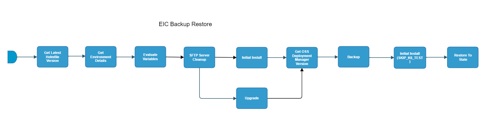

# eic-backup-restore-flow

[TOC]

[eic_backup_restore_flow](https://spinnaker.rnd.gic.ericsson.se/#/applications/eic-release-e2e-cicd/executions/configure/92a2293e-3dde-40ef-9c28-797ecb0c2c33)
## Introduction:
This pipeline performs a Backup, Export and Restore of EIC on a given ENV.

## Pipeline Parameters:

| name | description |
|-----|-----|
| CLEANUP_TYPE | The Type of cleanup that needs to be done. FULL will cleanup the deployment helm releases, crd helm releases, crd components, clusterroles, cluster rolebindings, namespaces (deployment and crd). Where as PARTIAL will only cleanup the deployment namespace. FULL cleanup option should NOT be used in such cases where single cluster is hosting multiple deployments. |
| CLEANUP_SFTP | |
| DDP_AUTO_UPLOAD | When set to true, enables the DDP auto upload |
| DEPLOYMENT_MANAGER_REPO | Deployment Manager Repository. |
| DEPLOYMENT_MANAGER_VERSION | Deployment Manager version. |
| ENV_NAME | The test environment to use for the flow. |
| TO_STATE_SITE_VALUE_FILE | Name of the datafile in OST bucket. |
| TO_STATE_SITE_VALUES_OVERRIDE_FILE | Name of the datafile in OST bucket. |
| INSTALL_OR_UPGRADE | Choose to run 'Install' or 'Upgrade'. |
| INT_CHART_VERSION | The version of integration chart |
| K6_TESTWARE_VERSION | The version of the K6 testware to be used |
| NAMESPACE | Namespace of environment |
| RCF_TAG | RCF Tag is used to identify the environment by Report Center Registration Stage for Child flows |
| RUN_ENM_INTEGRATION_TEST | When set to true, ENM integration tests will be run |
| SFTP_CREDENTIALS_ID | Credentials for SFTP |
| SFTP_SERVER_PATH | Server path of SFTP |
| SLAVE_LABEL |  |
| USE_DM_PREPARE | When set to true uses the site values generated from the Deployment manager prepare command for the deployment. |
| USE_REAL_CSAR | Option to use real CSAR. If false then dummy CSAR will be used |

## Pipeline stages

### Get Latest Helmfile Version:
This stage runs a Jenkins job [Get-Latest-ChartOrHelmfile](https://fem5s11-eiffel052.eiffel.gic.ericsson.se:8443/jenkins/job/Get-Latest-ChartOrHelmfile) (Ticketmaster owned Jenkins job).

#### Description:
This Job gets the latest version of the Integration of the Helmfile.
 * * *
### Get Environment Details:
This stage runs a Jenkins Job [DSC-DIT-Download-Document-As-Artifact](https://fem5s11-eiffel216.eiffel.gic.ericsson.se:8443/jenkins/job/DSC-DIT-Download-Document-As-Artifact) (Thunderbee owned Jenkins job).

#### Description:
This Job is used to retrieve the properties of a Test Environment from DIT.
 * * *
### Evaluate Variables:
This stage evaluates variables to be referenced downstream.

#### Description:
This stage evaluates:

- TO_STATE_SITE_VALUES_OVERRIDE_FILE
- TO_STATE_SITE_VALUES_FILE
- SKIP_TESTS
- RUN_TESTS
- ECM_HOSTNAME
- ENM_HOSTNAME
- INT_CHART_VERSION

 * * *
### SFTP Server Cleanup:
This stage runs a jenkins job []
### Initial Install:
This stage runs a spinnaker pipeline [EIC_Release_SFTP_Server_Cleanup](https://fem5s11-eiffel052.eiffel.gic.ericsson.se:8443/jenkins/job/EIC_Release_SFTP_Server_Cleanup/) (Release owned job).

#### Description
This stage performs a cleans up all backups from external EIC Release SFTP server.
 * * *
### Initial Install:
This stage runs a spinnaker pipeline [eic-release-install-flow](https://spinnaker.rnd.gic.ericsson.se/#/applications/eic-release-e2e-cicd/executions/configure/903cef19-f589-4286-bb50-45ab52f92de0) (Thunderbee owned pipeline) [Pipeline Documentation](/cicd_pipelines_documentation_and_diagrams/release/common_release_child_flows/documentation/eic_release_upgrade_flow.md).

#### Description
This stage performs an install to the specified integration chart version.
 * * *
### Upgrade:
This stage runs a Spinnaker pipeline [eic-release-upgrade-flow](https://spinnaker.rnd.gic.ericsson.se/#/applications/eic-release-e2e-cicd/executions/configure/e6c06ca6-1798-48ae-bc07-6406460db4a2) (Thunderbee owned pipeline).

#### Description:
This stage performs an upgrade to the specified integration chart version.
 * * *
### Get OSS Deployment Manager Version
This stage evaluates the deployment manager version variable to be referenced downstream. This value is taken from either the Install or Update stage

#### Description
This stage evaluates:

- DEPLOYMENT_MANAGER_VERSION

 * * *
### Backup:
This stage runs a Jenkins job [EO_BUR_Run_Backup](https://fem5s11-eiffel052.eiffel.gic.ericsson.se:8443/jenkins/job/EO_BUR_Run_Backup) (Laika owned Jenkins job).

#### Description:
Pipeline used for testing Backup & Restore script
 * * *
### Initial Install To State (SKIP_TESTS == true):
This stage runs a spinnaker pipeline [eic-release-install-flow](https://spinnaker.rnd.gic.ericsson.se/#/applications/eic-release-e2e-cicd/executions/configure/903cef19-f589-4286-bb50-45ab52f92de0) (Thunderbee owned pipeline) [Pipeline Documentation](/cicd_pipelines_documentation_and_diagrams/release/common_release_child_flows/documentation/eic_release_upgrade_flow.md).

#### Description
This stage performs an install to the specified integration chart version but skips running the k6 tests.
 * * *
### Restore To State:
This stage runs a spinnaker pipeline [eic-release-data-restore-and-verify-flow](https://spinnaker.rnd.gic.ericsson.se/#/applications/eic-release-e2e-cicd/executions/configure/577168a6-5bad-4f42-931a-61806f2b1d9e) (Thunderbee owned pipeline) [Pipeline Documentation](/cicd_pipelines_documentation_and_diagrams/release/taap_release_child_flows/documentation/eic_release_data_restore_and_verify_flow.md).

#### Description
This stage backs up and restore data using the EIC Release data Restore and Verify flow linked above.
 * * *
